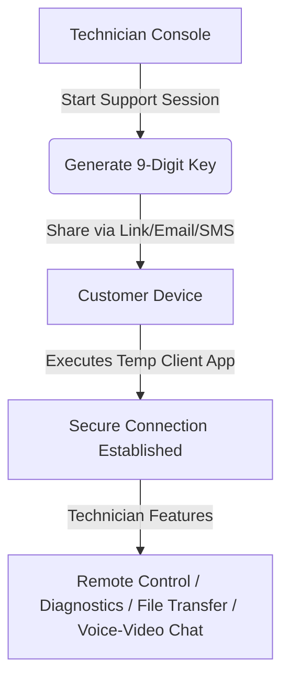

# Zoho One Complete Feature Suite: Detailed Research & Reference Blueprint
*An Exhaustive Systems Analysis of Zoho One's Product Portfolio for Self-Hosted Enterprise Mapping*

---

##  EXECUTIVE OVERVIEW

This reference document compiles exhaustive functional specifications, modules, settings, permissions, integrations, and step-by-step workflows for **all major products and platform features of the Zoho One suite**. 

In the context of **Company OS**, this research functions as a comprehensive functional target blueprint. By understanding Zoho One's product architectures, modules, database associations, and automation engines, we establish the requirements for building a unified, self-hosted, seat-fee-free corporate alternative.

---

## TABLE OF CONTENTS
1. [Optimize Suite (Sales, HR & Productivity)](#1-optimize-suite-sales-hr--productivity)
   - Zoho CRM
   - Zoho Bigin
   - Zoho Bookings
   - Zoho Forms
   - Zoho SalesIQ
   - Zoho People
   - Zoho Directory
   - Zoho Vault
   - Zoho Notebook
   - Zoho Calendar
2. [Grow Suite (Marketing, Social & Recruitment)](#2-grow-suite-marketing-social--recruitment)
   - Zoho Marketing Automation
   - Zoho Campaigns
   - Zoho Survey
   - Zoho Social
   - Zoho Publish
   - Zoho Thrive
   - Zoho Sites
   - Zoho Recruit
3. [Engage Suite (Collaboration, Projects & Media)](#3-engage-suite-collaboration-projects--media)
   - Zoho Sign
   - Zoho Cliq
   - Zoho Projects
   - Zoho Sprints
   - Zoho Vani
   - Zoho Learn
   - Zoho WorkDrive
4. [Create, Express & Unique Features Suite](#4-create-express--unique-features-suite)
   - Zoho Creator (Low-Code)
   - Zoho Flow (Integration)
   - Zoho Analytics (BI)
   - Zoho DataPrep (ETL)
   - Zoho Writer, Sheet, Show
   - Zoho Commerce & Checkout
   - Zoho Inventory
   - Zoho Books & Invoice
   - Zoho Expense & Billing
   - Zoho Payroll
   - Zia AI & Unified Search
   - Admin Panel, Workflow Rules & Deluge Scripting
5. [Support & Communication Suite (Helpdesk, Remote IT & Corporate Mail)](#5-support--communication-suite-helpdesk-remote-it--corporate-mail)
   - Zoho Desk
   - Zoho Assist
   - Zoho Lens (AR)
   - Zoho Mail
   - Zoho Meeting
   - Zoho Connect
   - Zoho Contracts
   - Zoho BugTracker

---


---

# Optimize Suite (Sales, HR & Productivity)

# ZOHO ONE "OPTIMIZE" CATEGORY — EXHAUSTIVE PRODUCT RESEARCH

---

## 1. ZOHO CRM — Full CRM Platform

### Complete Feature List &amp; Sub-Features

**Sales Force Automation**
- Lead Management: Capture leads from web forms, social media, email, live chat, trade shows; auto-assign via round-robin or criteria-based rules; lead scoring (field values + interaction-based); lead conversion to Contact/Account/Deal
- Contact Management: 360° view of contacts, communication history, social media profiles, related deals/activities; duplicate detection &amp; merge
- Account Management: Parent-child account hierarchy, account-level analytics, related contacts/deals/activities
- Deal Management: Visual pipeline (Kanban board), stage probability, weighted pipeline, expected revenue, deal aging, competitor tracking
- Activities: Tasks, Events, Calls (logged via telephony), Meetings; recurring activities; activity reminders
- Products: Product catalog with pricing, product bundles, tax rules
- Quotes (CPQ): Configure-Price-Quote; product configurator with compatibility rules; dynamic price rules (volume discounts, conditional pricing); quote templates; conversion to Sales Orders/Invoices
- Sales Orders &amp; Invoices: Inventory management modules; order tracking; invoice generation; integration with Zoho Books
- Vendors &amp; Purchase Orders: Vendor management, purchase order creation

**Multichannel Communication**
- Email: IMAP/POP integration (Gmail, Outlook, Office 365); email templates; mail merge; email scheduling; email tracking (opens/clicks); BCC dropbox; SalesInbox (email client within CRM prioritized by deal value)
- Telephony (PhoneBridge): Click-to-call; automatic call logging; call recording; screen pops; integration with 50+ telephony providers (Zoho Voice, RingCentral, Twilio, etc.)
- Live Chat: Integration with Zoho SalesIQ; chat transcripts linked to CRM records
- Social Media: Social tab for monitoring Twitter, Facebook, LinkedIn interactions
- WhatsApp Business: Direct messaging from CRM records
- SMS: SMS notifications and campaigns via integration
- Web Conferencing: Integration with Zoho Meeting, Zoom, Google Meet

**Automation Capabilities**
- Workflow Rules: Trigger on record create/edit/delete/field update; conditions (criteria-based, date-based); actions (email alerts, tasks, field updates, webhooks, custom functions)
- Blueprint: Visual process designer enforcing sales methodology; mandatory fields per stage; SLA timers; transition rules with conditions; parallel transitions
- Macros: One-click execution of repetitive multi-step actions (send email + update field + create task)
- Assignment Rules: Auto-assign records based on criteria or round-robin distribution
- Scoring Rules: Add/subtract points based on field values and email/call/chat interactions
- Approval Processes: Multi-level approval chains with delegation
- CommandCenter: Finite State Machine-based customer journey orchestration; cross-app signals (Zoho Desk, SalesIQ, Survey, etc.); journey analytics dashboard; bottleneck identification
- Schedules: Time-based automation (daily/weekly/monthly)
- Custom Functions (Deluge): Server-side scripting for complex business logic
- Client Scripts: Client-side JavaScript for UI customization
- Cadences: Automated follow-up sequences (email/call/task)

**AI — Zia**
- Predictive Lead/Deal Scoring: ML-based probability of conversion
- Best Time to Contact: AI-recommended optimal call/email times
- Sentiment Analysis: Email sentiment detection (positive/negative/neutral)
- Anomaly Detection: Alerts when metrics deviate from expected trends
- Generative AI: Natural language to workflow/module/report generation
- Formula Generation: Natural language to formula field conversion
- Email Content Suggestions: AI-drafted email responses
- Data Enrichment: Auto-populate company/contact info from web sources
- Zia Voice: Voice commands for CRM operations
- Prediction Builder: Custom prediction models on any module
- Recommendation Engine: Next-best-action suggestions

**Reporting &amp; Analytics**
- Standard Reports: 40+ pre-built reports (lead conversion, sales by source, pipeline by stage, activity reports, revenue forecasts)
- Custom Reports: Drag-and-drop report builder; summary, tabular, matrix report types; sub-reports; cross-module reports
- Dashboards: Drag-and-drop dashboard builder; chart types (bar, pie, line, funnel, donut, area, heat map, KPI widgets, comparators, target meters, anomaly detectors)
- Advanced Analytics: Integration with Zoho Analytics for deep BI; cross-departmental reporting
- Forecasting: Revenue forecasting by territory/role/user; forecast categories (Pipeline, Best Case, Committed, Closed)
- Cohort Analysis: Customer retention analysis
- Quadrant Analysis: Two-variable comparison for strategic insights
- COQL (CRM Object Query Language): SQL-like querying for custom data extraction via API

**Customization &amp; Configuration**
- Canvas: No-code UI design tool to completely redesign record detail pages, list views, and module layouts with drag-and-drop
- Custom Modules: Unlimited custom modules with custom fields (200+ field types)
- Custom Views: Filtered lists with conditions; shared/private views
- Page Layouts: Multiple layouts per module based on record type
- Validation Rules: Data integrity enforcement
- Custom Buttons &amp; Links: Execute custom functions or open URLs
- Wizards: Multi-step guided forms for data entry
- Subforms: Inline editable tables within records
- Tags: Color-coded record classification
- Related Lists: Custom related information panels

**Settings &amp; Configuration**
- Organization Settings: Company info, fiscal year, currency, locale, business hours
- Users &amp; Control: User management, role hierarchy, profiles (permissions), data sharing rules, groups, territory management
- Channels: Email configuration, telephony setup, social channels, chat, portals, notification SMS, business messaging
- Data Administration: Import/export, data backup, storage management, recycle bin, audit log, data migration
- Security Control: IP restrictions, compliance settings (GDPR, HIPAA), encryption at rest
- Marketplace: Zoho Marketplace extensions and integrations
- Developer Hub: API dashboard, webhooks, connections, widgets, SDKs
- Sandbox: Isolated testing environment; deploy changes to production

**User Roles &amp; Permissions**
- Roles: Hierarchical role structure (CEO → VP → Manager → Rep); determines data visibility (higher roles see subordinate data)
- Profiles: Permission sets controlling module access, field-level access, feature access (import, export, API, etc.)
- Data Sharing Rules: Default organization-wide access (Private/Public Read Only/Public Read-Write-Delete); criteria-based sharing rules
- Territory Management: Geographic or account-based record segmentation; territory hierarchy; territory-based forecasting
- Groups: Logical groupings of users for assignment/sharing
- Field-Level Security: Control which fields are visible/editable per profile
- CRM for Everyone (CRM4E): Extend CRM access to non-sales departments without full licenses

**Portals**
- Customer Portal: External users (customers, vendors, partners) can log in and view/edit specific records based on permissions
- Customizable portal appearance and module access

**SalesSignals**
- Real-time notification aggregator across all channels (email opens, website visits, support tickets, survey responses, chat messages, missed calls)

**Segmentation**
- RFM Segmentation: Recency, Frequency, Monetary analysis for customer categorization
- Custom segmentation based on any criteria

**Integrations with Other Zoho Products**
- Zoho Books/Invoice: Accounting sync
- Zoho Desk: Support ticket visibility in CRM
- Zoho Campaigns: Email marketing sync
- Zoho Survey: Survey responses linked to records
- Zoho SalesIQ: Live chat integration
- Zoho Analytics: Advanced BI
- Zoho Meeting: Web conferencing
- Zoho Sign: E-signatures
- Zoho Projects: Project management
- Zoho Forms: Web form data capture
- Zoho Bookings: Appointment scheduling
- Zoho Flow: Cross-app automation
- 800+ third-party integrations via Marketplace

**API Features**
- REST API v7 (latest); OAuth 2.0 authentication
- CRUD operations on all modules
- COQL for complex queries
- Bulk API for mass operations (insert, update, upsert)
- Record Clone API, Data Enrichment API, Cadence API
- Notification API (webhooks)
- API Dashboard: Usage monitoring, top consumers, health metrics
- Region-based endpoints (.com, .eu, .in, .com.au, .jp)
- Rate limits: Varies by plan (typically 100-200 API calls/min)

**Mobile Capabilities**
- Native iOS &amp; Android app; full module access; offline mode with sync
- Mobile-specific features: Business card scanner, check-in (geo-location), voice notes
- RouteIQ: Route planning for field sales
- Analytics dashboards on mobile

---

## 2. ZOHO BIGIN — Pipeline-Centric CRM for Small Business

### Complete Feature List &amp; Sub-Features

**Core Modules**
- Contacts: Individual contact records with full communication history, social profiles, notes
- Companies: Organization-level records linked to contacts
- Pipelines (Deals): Visual Kanban pipeline view; drag-and-drop stage management; custom stages; multiple pipelines (Sales, Onboarding, Support, etc.)
- Team Pipelines: Non-sales pipelines for operations (e.g., customer onboarding, project delivery, bug tracking)
- Activities: Tasks, Events, Calls; activity scheduling with reminders
- Products: Product/service catalog linked to deals
- Notes: Contextual notes attached to records

**Pipeline Management**
- Custom pipeline stages with probability percentages
- Connected Pipelines: Link different pipeline types (e.g., sales pipeline feeds into onboarding pipeline)
- Deal filters and search
- Stage movement history tracking

**Multichannel Communication**
- Email: Send/receive within Bigin; email templates; email tracking (opens)
- Phone: Built-in telephony; click-to-call; call logging
- WhatsApp Business: Direct messaging from records
- Twitter: Social engagement tracking

**Automation &amp; Workflows**
- Workflow Rules: Triggers (record created, edited, date-based); Actions (send email, create task, update field, add tag, send webhook)
- Stage Automation: Automatic actions when deal moves to specific stage
- Email Templates: Pre-built templates for common communications
- Instant Actions: Quick one-click actions on records

**Analytics &amp; Reporting**
- Built-in Dashboard: KPI widgets (revenue, deal count, conversion rate); chart types (pie, bar, funnel, line)
- Custom Charts: Create custom visualizations
- Pipeline Analysis: Stage-wise deal distribution; pipeline velocity
- Activity Reports: Team activity tracking
- Advanced Analytics: Integration with Zoho Analytics (75+ pre-built reports &amp; dashboards including sales performance, pipeline 360° views)

**Roles &amp; Permissions**
- Roles: Hierarchical role structure (CEO/Manager/Rep)
- Profiles: Administrator vs Standard user (controls feature access)
- Peer Data Visibility: Configure whether same-role users can see each other's data
- Record-level sharing

**Integrations**
- Zoho CRM (data migration path)
- Zoho Desk, Zoho Campaigns, Zoho Forms, Zoho Analytics, Zoho Meeting, Zoho Bookings, Zoho Flow
- Google Workspace, Microsoft 365, Mailchimp, Zapier
- 100+ third-party integrations

**API Features**
- REST APIs: Full CRUD operations on Contacts, Companies, Deals, Activities
- Bulk APIs: Mass data operations
- Notification APIs: Webhooks for real-time event notifications
- Developer documentation with SDKs

**Mobile Capabilities**
- Full-featured iOS &amp; Android app
- Pipeline view on mobile; record management; push notifications
- Built-in telephony; call from app
- Real-time data sync
- Offline access

**Settings &amp; Configuration**
- Custom fields (text, number, date, lookup, formula, etc.)
- Custom views and filters
- Email configuration
- Notification preferences
- Import/Export tools
- Data backup

---

## 3. ZOHO BOOKINGS — Appointment Scheduling

### Complete Feature List &amp; Sub-Features

**Booking Page Management**
- Customizable Booking Pages: Branded pages with company logo, colors, custom URLs
- Service Configuration: Define services with duration, pricing, buffer time, and description
- One-on-One Bookings: Individual appointments
- Group Bookings: Workshops, webinars, classes with participant limits
- Round-Robin Scheduling: Auto-distribute appointments across staff
- One-Time Booking URLs: Disposable scheduling links for ad-hoc meetings
- Booking Page Embedding: Embed scheduling widget on websites

**Workspace Management**
- Multiple Workspaces: Separate booking pages for different departments (HR, Finance, Sales, etc.)
- My Space Module: Individual staff member dashboard for managing personal appointments
- Service Categories: Group related services together

**Staff Management**
- Individual staff profiles with availability settings
- Custom working hours per staff member
- Special hours configuration (holidays, overtime)
- Time-off management
- Role-Based Access: Super Admin, Admin, Manager, Staff levels
- Staff-level restrictions on visibility

**Scheduling Intelligence**
- Real-Time Availability: Auto-show only available slots based on calendar sync
- Buffer Time: Gap between appointments for preparation
- Advance Scheduling Window: Control how far ahead clients can book
- Minimum Scheduling Notice: Prevent last-minute bookings
- Slot Intervals: Customize time slot increments

**Notifications &amp; Reminders**
- Automated Email Reminders: Pre-appointment reminders to reduce no-shows
- SMS Reminders: Text message notifications
- Custom Notification Templates: Branded emails for booking confirmation, rescheduling, cancellation
- Staff Notifications: Alerts for new/modified bookings

**Client Management**
- Custom Booking Forms: Collect client information before booking (name, email, phone, custom fields)
- Appointment Qualification: Pre-booking questionnaires
- Client History: Past appointment tracking

**Payments**
- Online Payment Collection: Full or partial payments at booking time
- Payment Gateways: Stripe, PayPal, Zoho Checkout, Razorpay
- Deposit Configuration: Require deposits for specific services

**Automation &amp; Workflows**
- Trigger-based automation on booking events (booked, rescheduled, cancelled, completed, no-show)
- Deluge Custom Functions: Server-side scripting for complex logic
- Timed Actions: Actions triggered before/after specific durations relative to appointment time
- Zoho Flow integration for 1000+ app connections

**Analytics &amp; Reports**
- Revenue Tracking: Total income, payment status analysis
- Staff Performance: Individual productivity, demand analysis
- Appointment Trends: Popular services, booking conversion rates, no-show statistics
- Integration with Zoho Analytics for advanced dashboards

**Calendar Integrations**
- Two-Way Sync: Google Calendar, Office 365/Outlook, Zoho Calendar
- Prevents double-booking across synced calendars
- Video Meeting Integration: Zoho Meeting, Zoom, Google Meet, Microsoft Teams (auto-generate meeting links)

**Integrations with Zoho Products**
- Zoho CRM: Sync booking data to Leads/Contacts/custom modules; create/update CRM records on booking
- Zoho Bigin: Pipeline integration
- Zoho SalesIQ (Zobot): Chatbot-driven appointment booking
- Zoho Calendar: Calendar sync
- Zoho Meeting: Auto-create online meetings
- Zoho FSM: Field service appointment management
- Zoho Flow: Cross-app automation

**API Features**
- REST API for custom integrations
- Deluge scripting support
- Webhook support for real-time event notifications
- OAuth 2.0 authentication

**Mobile Capabilities**
- Web-responsive booking pages for client-side mobile booking
- Staff can manage appointments via Zoho ecosystem mobile apps

**Settings &amp; Configuration**
- Timezone settings (auto-detect client timezone)
- Language/locale settings
- Cancellation/rescheduling policies
- Booking page access controls (public vs. private)
- Custom domain mapping

---

## 4. ZOHO FORMS — Online Form Builder

### Complete Feature List &amp; Sub-Features

**Form Building**
- Drag-and-Drop Builder: No-code visual editor
- 30+ Field Types: Text, number, email, phone, dropdown, radio button, checkbox, multi-select, date/time, file upload, signature capture, image choice, rating, slider, matrix choice, calculation fields, section headers, page breaks, decision box
- Conditional Logic (Show/Hide): Dynamically show/hide fields, pages, sections based on previous answers
- AI-Powered Form Generation: Describe form in natural language, AI creates draft
- PDF/Image to Form: Digitize paper forms into interactive web forms
- 500+ Pre-built Templates: Lead generation, HR onboarding, customer feedback, event registration, order forms, surveys, quizzes
- Multi-Page Forms: Break long forms into pages with progress bar
- Subforms: Repeatable field groups within a form
- Form Rules: Field validation, auto-populate, calculate values

**Form Types**
- Standard Web Forms
- CRM Forms: Direct integration with Zoho CRM modules
- Card Forms: One question per screen experience
- Quiz Forms: Scored assessments with correct answers

**Design &amp; Theming**
- Theme Gallery: Pre-built visual themes
- Custom CSS: Advanced styling control
- Branding: Custom logos, colors, fonts, backgrounds
- Responsive Design: Auto-adapts to all screen sizes
- Multilingual Forms: Support for multiple languages

**Workflow &amp; Approval**
- Approval Workflows: Multi-level approval chains (e.g., Employee → Manager → HR)
- Task Assignments: Auto-assign follow-up tasks based on form responses
- Record Status Tracking: Track submissions through approval stages
- Conditional Routing: Route submissions to different approvers based on criteria
- SLA Timers: Set deadlines for approvals

**Notifications**
- Email Notifications: Customizable alerts to form owner, respondent, or third parties
- SMS Notifications: Text message alerts on submission
- Push Notifications: Mobile app alerts
- Conditional Notifications: Different notifications based on response values

**Document Generation**
- Auto-generate branded PDF documents from submissions
- Merge fields from form data into document templates
- Email generated PDFs automatically

**Payments**
- Payment Fields: Collect one-time or recurring payments
- Supported Gateways: Stripe, PayPal, Razorpay, Square, Authorize.Net, Instamojo, 2Checkout, PayPal Commerce
- Order Forms: Product selection with quantity and pricing
- Payment Confirmation Workflows: Trigger actions after successful payment

**E-Signatures**
- Built-in Signature Field: Handwritten-style signatures on any device
- Zoho Sign Integration: Legally binding e-signatures with audit trail, compliance tracking, custom PDF templates

**Analytics &amp; Reporting**
- Form Analytics: Page views, conversion rates, drop-off analysis, error logs, average completion time
- Response Summary: Visual summary of all responses
- Individual Response View: Detailed view per submission
- Export: CSV, PDF, Excel export
- Integration with Zoho Analytics for advanced reporting and custom dashboards

**Roles &amp; Permissions**
- Super Admin: Full organizational control
- Admin: User management, form status control
- User: Form creation, report access
- Respondent: Form submission access only
- Department-level form sharing and access control

**Integrations with Zoho Products**
- Zoho CRM: Map form fields to CRM modules (Leads, Contacts, custom); create/update records on submission
- Zoho Creator: Advanced app building
- Zoho Desk: Create support tickets from forms
- Zoho Campaigns: Add form respondents to mailing lists
- Zoho Sheet: Auto-populate spreadsheets
- Zoho Books/Invoice/Inventory: Trigger financial workflows
- Zoho Contracts: Contract generation
- Zoho Flow: Connect to 1000+ apps
- Third-party: Zapier, Google Sheets, Slack, Mailchimp, HubSpot, Salesforce

**API Features**
- REST API for form creation, response retrieval, and management
- Webhook support for real-time event notifications
- OAuth 2.0 authentication
- Embed API for custom embedding

**Mobile Capabilities**
- Native iOS &amp; Android app
- Offline Data Collection: Build, edit, fill forms without internet; auto-sync when online
- Kiosk Mode: Lock device to single form for events/reception
- Mobile Camera Integration: Photo capture within forms
- GPS Location Capture: Geo-tag submissions
- Barcode/QR Scanner: Scan into form fields

**Settings &amp; Configuration**
- Form access controls (public, private, password-protected)
- Submission limits (per user, total)
- Scheduled form availability (open/close dates)
- Thank-you page customization / redirect URLs
- CAPTCHA / reCAPTCHA security
- Double opt-in for email collection
- Spam protection filters
- GDPR compliance tools (consent fields, data deletion)
- Custom domain mapping

---

## 5. ZOHO SALESIQ — Live Chat &amp; Visitor Tracking

### Complete Feature List &amp; Sub-Features

**Live Chat**
- Real-Time Chat Widget: Customizable appearance (colors, position, greeting messages, operator photos)
- Proactive Chat Triggers: Auto-initiate chat based on visitor behavior (time on page, scroll depth, specific URL, exit intent, number of visits, referral source)
- Chat Routing: Route to specific departments/operators based on page, query, or visitor attributes
- Canned Responses: Pre-built quick replies for common queries
- Chat Transfer: Transfer between operators/departments
- Chat Rating: Post-chat satisfaction surveys
- Typing Preview: See what visitor is typing before they send
- Screen Sharing: Share screen with visitors for guided support
- Audio Calls: Voice call directly from chat widget
- File Sharing: Send/receive files during chat
- Chat History: Complete conversation archives searchable by visitor

**Chatbot Platform (Zobot)**
- Codeless Bot Builder: Drag-and-drop flow chart interface; pre-built cards (message, input, carousel, buttons, condition, action, delay)
- SalesIQ Script (Deluge) Bots: Code-based bot logic
- Zia Skills (NLP): Natural language processing for intent recognition
- AI Platform Integration: Dialogflow (Google), IBM Watson, Microsoft Azure Bot, OpenAI/ChatGPT
- Hybrid Chat: Seamless bot-to-human handoff
- Bot Analytics: Conversation success rate, handoff rate, resolution time
- Answer Bot: Auto-respond from knowledge base/FAQ articles
- Multi-Channel Bots: Deploy across website, WhatsApp, Facebook Messenger, Instagram, Telegram

**Visitor Tracking &amp; Intelligence**
- Real-Time Visitor Dashboard: Live view of all active website visitors
- Visitor Profile: IP address, location (city/country), browser, OS, device type, screen resolution
- Navigation Path: Page-by-page journey tracking
- Visit History: Returning visitor recognition with full visit history
- Referral Source: How visitor arrived (search engine, social media, direct, referral URL)
- Lead Scoring: Automatic Hot/Warm/Cold categorization based on configurable rules (visit frequency, page depth, time spent, actions taken)
- Custom Visitor Variables: Pass custom data (e.g., account type, subscription plan) from your app to SalesIQ
- Company Detection: Identify visitor's organization using reverse IP lookup

**Automation &amp; Triggers**
- Proactive Messages: Auto-display messages based on behavior rules
- Chat Routing Rules: Auto-assign chats based on department, agent availability, visitor attributes
- Workflow Automation: Webhooks and Zoho Flow for 500+ app connections
- Auto-Triggers: Actions on chat events (chat started, ended, missed, rated)

**Knowledge Base (Articles)**
- Resource Library: Create FAQ articles and help documentation
- Article Categories: Organize by topic
- Bot Integration: Zobot pulls answers from articles automatically
- Agent Assist: Suggest relevant articles to agents during chat

**Analytics &amp; Reporting**
- Real-Time Dashboard: Active visitors, ongoing chats, agent availability, queue status
- Chat Analytics: Total chats, response time, resolution time, missed chats, chat ratings
- Visitor Analytics: Traffic sources, popular pages, visitor geography, device breakdown
- Agent Performance: Individual agent metrics (response time, chats handled, ratings)
- Custom Reports: Filter by date, department, agent, channel
- Conversion Tracking: Track visitor-to-lead conversion rates

**Operator Management**
- Departments: Organize operators into teams
- Operator Roles: Admin, Supervisor, Associate
- Concurrency Limits: Control max simultaneous chats per operator
- Availability Status: Online, Busy, Away, Offline
- Operator Performance Monitoring: Real-time supervision

**Integrations with Zoho Products**
- Zoho CRM: Auto-push visitor/chat data to CRM; view CRM record within chat; create leads/contacts from chats
- Zoho Desk: Convert chats to support tickets; view ticket history during chat
- Zoho Campaigns: Trigger email campaigns based on chat events
- Zoho Survey: Send surveys post-chat
- Zoho Analytics: Advanced reporting
- Zoho Flow: Cross-app automation

**API &amp; Developer Tools**
- REST API: CRUD for visitors, chats, operators
- JavaScript API: Customize chat widget behavior; pass custom variables; trigger events
- Webhooks: Real-time data delivery for chat events
- Mobile SDK (Mobilisten): Embed SalesIQ in native iOS, Android, React Native, Flutter, Cordova apps; in-app chat and support

**Mobile Capabilities**
- Native iOS &amp; Android operator app
- Push notifications for new chats
- Chat management on the go
- Visitor tracking from mobile
- Mobilisten SDK for in-app customer engagement

**Settings &amp; Configuration**
- Chat widget customization (appearance, position, language)
- Operating hours configuration
- Offline message handling
- Pre-chat and post-chat forms
- Blocked visitors management
- IP/country-based restrictions
- GDPR compliance (consent banners, data management)
- Branding removal (paid plans)
- Custom domain for chat widget

---

## 6. ZOHO PEOPLE — HRMS Platform

### Complete Feature List &amp; Sub-Features

**Core HR / Employee Database**
- Employee Records: Centralized database with personal details, employment history, documents, photos
- Employee Self-Service Portal: Employees update own info, view payslips, download documents
- Organization Chart: Visual hierarchy of reporting structure
- Department &amp; Designation Management: Define organizational units
- Employee Lifecycle Tracking: Hire to retire tracking
- Document Management: Store, share, and manage employee documents (offer letters, contracts, certificates)
- Custom Fields &amp; Forms: Create custom data modules for organization-specific needs
- Employee Directory: Searchable company directory

**Onboarding**
- Pre-boarding Portal: New hires complete paperwork before day 1
- Onboarding Checklists: Task lists for HR, IT, Manager, and new hire
- Document Collection: Automated document request and collection
- Induction Workflows: Orientation schedules and training assignments
- Welcome Kits: Digital welcome packages

**Attendance Management**
- Check-in Methods: Web, mobile app, biometric integration, facial recognition, kiosk
- IP Restrictions: Allow check-in only from specific IP addresses
- Geofencing: Location-based check-in/check-out
- Shift Scheduling: Create and assign shifts; auto-rotate shifts; split shifts
- Overtime Tracking: Auto-calculate overtime hours
- Regularization: Employees can request attendance corrections
- Attendance Reports: Late arrivals, early departures, muster rolls, monthly summaries
- Integration with access control systems

**Leave Management**
- Custom Leave Types: Annual, sick, casual, maternity, paternity, compensatory, etc.
- Leave Policies: Accrual rules, carry-forward limits, encashment policies, probation restrictions
- Leave Calendar: Visual team leave calendar
- Holiday Calendar: Organization/location-specific holiday lists
- Leave Balance Tracking: Real-time leave balance for employees
- Approval Workflows: Multi-level leave approval chains
- Leave Reports: Department-wise, trend analysis

**Time Tracking &amp; Timesheets**
- Project-Based Time Logging: Log hours against projects, jobs, clients
- Timesheet Approval Workflows: Manager approval process
- Timer Widget: Start/stop timer for real-time tracking
- Billable vs Non-Billable Hours: Categorize time entries
- Timesheet Reports: Project cost analysis, utilization reports
- Client &amp; Job Management: Define clients and jobs for time allocation

**Performance Management**
- Goal Setting: KRAs (Key Result Areas) and OKRs (Objectives &amp; Key Results)
- Continuous Feedback: Peer-to-peer and manager feedback; real-time recognition
- Self-Appraisals: Employee self-evaluation forms
- 360-Degree Reviews: Multi-rater feedback (peers, subordinates, managers, external)
- Appraisal Cycles: Configurable review periods (quarterly, semi-annual, annual)
- Performance Ratings: Customizable rating scales
- 9-Box Matrix: Talent assessment grid (Performance vs Potential)
- Skill Matrix: Track employee competencies and skill gaps
- Performance Reports: Individual, team, and department analytics
- Calibration: Ensure rating consistency across teams

**Learning Management System (LMS)**
- Course Creation: Build self-paced, instructor-led, or blended courses
- Content Types: Videos, documents, presentations, SCORM packages
- Assessments: Quizzes and tests with grading
- Certifications: Issue completion certificates
- Learning Paths: Structured multi-course programs
- Enrollment Management: Auto-enroll or manual assignment
- Training Calendar: Schedule instructor-led sessions
- Learning Reports: Completion rates, quiz scores, learner progress
- External Training Tracking: Log external certifications

**Compensation Management**
- Salary Structure Definition: CTC components, benefits, allowances
- Salary Revisions: Initiate hikes with approval workflows
- Revision Letters: Auto-generate revision/offer letters
- Compensation Analytics: Salary distribution, revision history, department comparisons

**HR Help Desk (Case Management)**
- Employee Case Submission: Raise HR queries/grievances
- Case Categories: Organize by type (payroll, benefits, policy, etc.)
- SLA Management: Track response and resolution times
- Agent Assignment: Auto-assign or manual routing
- Knowledge Base: Self-service FAQ for common questions
- Case Reports: Volume, resolution time, category analysis

**Exit Management (Offboarding)**
- Resignation Workflow: Employee-initiated or HR-initiated
- Exit Interview: Customizable exit interview forms
- Asset Recovery Checklists: Track equipment return
- Knowledge Transfer Tasks: Assign handover activities
- Clearance Process: Multi-department clearance workflow
- Exit Reports: Attrition analysis, reason tracking

**HR Process Automation**
- Custom Workflows: Trigger-based automation for any HR process
- Approval Chains: Multi-level approvals for any form/request
- Email/SMS Notifications: Automated alerts for HR events
- Scheduled Actions: Date-triggered automation
- Blueprints: Process enforcement for complex HR workflows

**Analytics &amp; Reporting**
- HR Dashboard: Organization-wide metrics (headcount, attrition, gender ratio, department distribution)
- Custom Reports: Drag-and-drop report builder
- Pre-built Reports: Attendance, leave, performance, turnover, compensation
- Trend Analysis: Identify HR patterns over time
- Export: CSV, PDF, Excel

**Roles &amp; Permissions**
- Role-Based Access Control: Admin, HR Manager, Reporting Manager, Employee
- Function-Based Permissions: Granular control over feature access
- Location-Based Access: Restrict data visibility by office location
- IP-Based Restrictions: Control access from specific networks

**Integrations with Zoho Products**
- Zoho Payroll: Attendance/leave/LOP data sync for salary processing; statutory compliance (EPF, ESI, TDS, PT)
- Zoho Recruit: Recruitment pipeline → onboarding handoff
- Zoho Expense: Employee reimbursement management
- Zoho Sign: Digital signatures for HR documents
- Zoho Cliq: Team communication
- Zoho Analytics: Advanced HR analytics
- Zoho Flow: Cross-app automation

**API Features**
- REST API with OAuth 2.0
- JSON/XML data formats
- API modules: Employee, Attendance, Leave, Timesheet, Performance, LMS, Forms
- Bulk operations support
- Webhook notifications
- Rate limiting per module

**Mobile Capabilities**
- Native iOS &amp; Android app
- Mobile check-in/check-out with geofencing
- Leave apply/approve on mobile
- Face recognition attendance
- Employee directory access
- Push notifications for approvals
- Timesheet entry on mobile

**Settings &amp; Configuration**
- Multi-location support
- Multi-company management
- Custom fields and forms for every module
- Workflow rule configuration
- Notification templates
- Branding and theming
- Data import/export tools
- GDPR compliance tools
- Audit trails

---

## 7. ZOHO DIRECTORY — Identity &amp; Access Management

### Complete Feature List &amp; Sub-Features

**User Management**
- Centralized User Directory: Single source of truth for all workforce identities
- User Profiles: Name, email, department, designation, phone, photo
- Group Management: Create groups for department/role-based access
- User Lifecycle: Automated onboarding (provisioning) and offboarding (deprovisioning)
- Bulk User Operations: Import/create multiple users at once
- Self-Service Profile: Users update own profile information

**Single Sign-On (SSO)**
- SAML 2.0 SSO: Zoho Directory as Identity Provider (IdP) for SAML-based apps
- OIDC (OpenID Connect): Modern authentication protocol support
- App Catalog: 350+ pre-built SSO integrations (Slack, GitHub, Zendesk, AWS, Salesforce, Google Workspace, Microsoft 365, etc.)
- Custom SAML/OIDC Apps: Add any app supporting SAML or OIDC
- SSO Dashboard: One-click access to all assigned apps
- IdP Metadata Exchange: Download/upload IdP metadata for configuration

**User Provisioning &amp; Deprovisioning (SCIM)**
- SCIM Protocol: Automated user account creation/update/deletion across integrated apps
- Attribute Mapping: Map Zoho Directory fields to target app fields
- Group Provisioning: Sync group memberships to apps
- Deprovisioning: Auto-revoke access across all apps when user is deactivated
- Provisioning Logs: Track sync status and errors

**Multi-Factor Authentication (MFA)**
- Zoho OneAuth: Push notifications, QR codes, time-based OTP
- Passwordless Authentication: Biometric (fingerprint, face recognition)
- Adaptive MFA: Risk-based authentication (trigger MFA based on location, device, etc.)
- Hardware Key Support: FIDO2/U2F security keys
- Backup Verification: Recovery codes, backup phone

**Conditional Access Policies**
- IP-Based Rules: Allow/deny access from specific IP ranges
- Location-Based Rules: Geographic access restrictions
- Device-Based Rules: Require managed devices for access
- Time-Based Rules: Restrict access to business hours
- Platform-Based Rules: OS/browser restrictions
- Policy Combinations: Combine multiple conditions for granular control

**Device Management**
- Device Enrollment: Register Windows, Mac, Linux devices
- Device Authentication: Verify device identity before granting access
- Device Status Monitoring: Track managed vs. unmanaged devices
- Remote Actions: Password reset, device delist
- Device Compliance: Ensure devices meet security requirements

**Directory Integration**
- Active Directory Sync: Bi-directional sync with on-premise Microsoft AD
- Azure AD Integration: Cloud directory synchronization
- LDAP Support: Legacy directory system integration
- Hybrid Directory: Manage both cloud and on-premise identities

**Security Policies**
- Password Policies: Complexity requirements, length, expiration, history
- IP Restrictions: Organization-wide access control
- Session Management: Session timeout, concurrent session limits
- Allowed Domains: Restrict access to specific email domains

**Admin Panel**
- Centralized Dashboard: Overview of users, apps, security status
- Admin Roles: Super Admin, Admin, custom admin roles
- Mobile Admin Panel: Manage organization from mobile devices
- Activity Logs: Track administrative actions

**Reporting &amp; Analytics**
- Login Reports: Successful/failed login attempts, login locations
- App Usage Reports: Which apps are being used and by whom
- User Activity Reports: Track user behavior patterns
- Security Reports: MFA adoption, policy compliance
- Export: CSV/PDF report export

**Compliance**
- GDPR, HIPAA, SOC 2, ISO 27001 compliant
- Audit trails for all administrative actions
- Data residency options

**API &amp; Automation**
- REST API for user and group management
- SCIM API for provisioning
- Zoho Flow integration for workflow automation
- Webhook support

**Mobile Capabilities**
- Mobile Admin Panel for on-the-go management
- Zoho OneAuth mobile app for MFA
- Push notification-based authentication

---

## 8. ZOHO VAULT — Password Manager

### Complete Feature List &amp; Sub-Features

**Password Management**
- Secure Storage: AES-256 encryption; zero-knowledge architecture (host-proof hosting)
- Password Generator: Customizable length, character types, pronounceability
- Passkey Support: Store and manage FIDO2 passkeys
- Auto-Fill: Automatic credential filling in browsers and apps
- Auto-Capture: Auto-save new credentials when logging into sites
- Password Health Dashboard: Identify weak, reused, old, and compromised passwords
- Favorites: Quick access to frequently used credentials
- Search: Instant search across all stored items

**Organization &amp; Structure**
- Chambers: Enterprise password vaults for organization-wide credentials
- Personal Vault: Individual password storage separate from enterprise
- Folders: Group related credentials; nested folder hierarchy
- Custom Categories: Tags and labels for organization
- Secure Notes: Store sensitive text (license keys, Wi-Fi passwords, etc.)
- Secure Documents: Attach and store sensitive files (certificates, keys)

**Sharing &amp; Collaboration**
- Individual Sharing: Share specific passwords with team members
- Bulk Sharing: Share multiple credentials at once
- Folder Sharing: Share entire folders with teams/groups
- Third-Party Sharing: Share with external users (contractors, clients) without Vault accounts; time-limited access
- Granular Permissions: View-only, View+Edit, Full Control per shared item
- Ownership Transfer: Transfer credential ownership between users

**Emergency Access (Break-Glass)**
- Emergency Contacts: Designate trusted users for emergency access
- Emergency Declaration: Contacts can declare emergency to access critical passwords
- Organization Notification: Entire organization notified via email on emergency access
- Super Admin Override: Forcefully terminate emergency access if suspicious
- Full Audit Trail: Every emergency event logged

**Password Policies**
- Policy Templates: Define organization-wide password requirements
- Complexity Rules: Minimum length, character types, dictionary word prevention
- Expiration Policies: Force password rotation at set intervals
- Policy Enforcement: Apply policies to specific folders or categories

**Security Features**
- Zero-Knowledge Architecture: Master password never sent to server; client-side encryption/decryption
- Multi-Factor Authentication: Zoho OneAuth, Google Authenticator, hardware keys
- IP-Based Restrictions: Limit access to specific networks
- Geolocation Restrictions: Country-based access control
- Session Management: Auto-logout, concurrent session limits
- Breach Detection: Check passwords against known breach databases

**Audit &amp; Compliance**
- Real-Time Audit Logs: Track who accessed what, when
- 5 Audit Categories: Passwords, Folders, Users &amp; Groups, Others (admin changes), Super Audit (audit of audits)
- Tamper-Proof Logs: Cannot be deleted or modified
- Export Logs: CSV, PDF export
- Reports: Visual password health reports, sharing reports, access reports
- Compliance Support: SOC 2, GDPR, HIPAA, ISO 27001

**User Roles &amp; Permissions**
- Super Admin: Full control including emergency access management
- Admin: User management, policy configuration
- Standard User: Personal vault + access to shared credentials
- Guest: Limited external access
- Role-Based Access Control (RBAC): Granular permission assignment

**Browser Extensions**
- Supported Browsers: Chrome, Firefox, Microsoft Edge, Safari, Opera, Brave, Vivaldi, Ulaa
- Auto-fill and auto-capture
- Password generator within extension
- Quick search and launch

**Integrations**
- Zoho Directory: SSO integration
- Zoho OneAuth: MFA provider
- Active Directory: User sync
- Azure AD: Cloud directory sync
- Google Workspace: User provisioning
- Microsoft 365: User provisioning
- ITSM Platforms: ServiceNow, Jira integration for privileged access
- Zoho Flow: Workflow automation
- SSO for cloud apps: Launch apps directly from Vault

**API Features**
- REST API with OAuth 2.0
- User provisioning/deprovisioning API
- Credential management API
- Group structure sync API
- Bulk operations support

**Mobile Capabilities**
- Native iOS &amp; Android apps
- Apple Watch app
- Biometric Authentication: FaceID, fingerprint unlock
- Offline Access: Encrypted local backup
- Auto-fill on mobile: iOS AutoFill, Android Autofill Framework
- Mobile password generator
- Cross-device sync

**Settings &amp; Configuration**
- Master password configuration
- MFA setup
- Default sharing permissions
- Auto-logout timers
- Clipboard auto-clear
- Password generator defaults
- Notification preferences
- Import from other password managers (LastPass, 1Password, KeePass, Dashlane, Bitwarden, browsers)
- Export/Backup tools

---

## 9. ZOHO NOTEBOOK — Note-Taking App

### Complete Feature List &amp; Sub-Features

**Note Cards (Content Types)**
- Text Card: Rich text editor with formatting (bold, italic, headings, bullet/numbered lists, tables, code blocks, horizontal rules)
- Checklist Card: Interactive to-do lists with checkboxes; sub-tasks
- Audio Card: Voice recording with auto-transcription and speaker identification
- Photo Card: Image capture and storage; gallery view
- Sketch Card: Freehand drawing, diagrams, handwritten notes; pen, marker, eraser tools
- File Card: Attach PDFs, spreadsheets, documents, presentations
- Smart Cards: Auto-format web links into rich previews (articles, videos, tweets, recipes)

**Organization System**
- Notebooks: Primary containers for cards; customizable covers (color, photo, pattern)
- Stacks: Group related cards into collapsed bundles within a notebook
- Nested Collections: Sub-notebooks for hierarchical organization
- Tags: Cross-notebook tagging for thematic linking
- Favorites: Star important cards for quick access
- Color Coding: Visual categorization of cards

**Search &amp; Navigation**
- Full-Text Search: Search across all card content, including handwritten text (OCR)
- Tag-Based Filtering: Filter by tags
- Notebook Browsing: Visual notebook grid/list
- Recent Items: Quick access to recently edited cards

**Notebook AI (Zia)**
- Ask with My Content: Query your notes and get AI-generated answers using your own data
- Ask Anything: General AI assistant for brainstorming, research, explanations
- Summarization: Auto-summarize long notes
- Mind Map Generation: Convert notes into visual mind maps
- Outline Creation: Generate structured outlines from unstructured text
- Translation: 80+ languages including Indian languages
- Writing Assistance: Grammar correction, tone adjustment, content expansion
- Meeting Transcription: Auto-transcribe meetings with speaker identification
- Table Generation: Create structured tables from descriptions

**Web Clipper**
- Browser Extension: Chrome, Firefox, Safari, Edge
- Clip Types: Full article (clean view without ads), selected text, screenshot with annotations, link card, image
- Annotation Tools: Highlight, draw, add text to screenshots
- Meeting Capture: Save notes from Zoom/Zoho Meeting
- Quick Note: Create notes without leaving browser
- Auto-Sync: Clipped content syncs across all devices

**Collaboration &amp; Sharing**
- Share Notebooks: Invite collaborators to entire notebooks
- Share Individual Cards: Share specific notes
- Permission Levels: Read-only, Read-Write
- Real-Time Collaboration: Simultaneous editing with presence indicators
- Public Sharing: Generate shareable links
- Zoho Cliq Integration: Share notes in team chat

**Security**
- Note Locking: Password-protect individual cards
- Notebook Locking: Lock entire notebooks
- Biometric Lock: Touch ID, Face ID, fingerprint
- End-to-End Encryption: For locked notes
- Trash Protection: Deleted items recoverable from trash

**Cross-Platform Sync**
- Automatic Sync: Real-time across all devices
- Platforms: iOS, Android, macOS, Windows, Linux, Web browsers
- Offline Access: Full offline capability; sync when online

**Integrations with Zoho Products**
- Zoho Writer: Convert notes to documents
- Zoho Projects: Link notes to project tasks
- Zoho CRM: Attach notes to CRM records
- Zoho Cliq: Share and discuss notes
- Zoho Mail: Save emails as notes
- Zoho Flow: Automate note creation from other app triggers
- Zoho WorkDrive: File management integration

**API Features**
- REST API with OAuth 2.0 authentication
- CRUD operations on notebooks and cards
- Zoho Flow connectors for automation
- Third-party integration via Make (Integromat), Zapier

**Mobile Capabilities**
- Native iOS &amp; Android apps (tablets included)
- Widgets: Home screen widgets for quick note creation
- Camera Integration: Scan documents, capture photos directly to cards
- Audio Recording: Voice memos with one tap
- Sketch on Mobile: Touch-based drawing
- Offline Access: Full functionality without internet
- Push Notifications: Shared note updates

**Settings &amp; Configuration**
- Default Notebook selection
- Sync preferences
- Lock settings (passcode, biometric)
- Theme (light/dark mode)
- Text formatting defaults
- Notification preferences
- Storage management
- Account management
- Import from Evernote, Google Keep, OneNote, Apple Notes

---

## 10. ZOHO CALENDAR — Calendar &amp; Scheduling

### Complete Feature List &amp; Sub-Features

**Event Management**
- Event Creation: Title, description, location, time, duration, recurring patterns
- Recurring Events: Daily, weekly, monthly, yearly; custom recurrence rules (e.g., every 2 weeks on Tuesday and Thursday)
- All-Day Events: Full-day entries
- Private Events: Hidden details from shared viewers
- Event Colors: Color-code events by category
- File Attachments: Attach documents to events for meeting preparation
- Event Notes: Add detailed notes to events
- Reminders: Pop-up, email, and push notification reminders; multiple reminders per event; custom reminder times

**Scheduling**
- Smart Scheduling: Auto-check participant availability; suggest optimal meeting times
- Appointment Scheduler: Public booking page for external clients/colleagues to book time
- Free/Busy View: See availability of team members at a glance
- Time Slot Intervals: Customize available booking increments
- Scheduling Conflicts: Automatic detection and warnings
- Secondary Time Zone: Display dual time zones for global teams

**Calendar Views**
- Day View: Hour-by-hour daily schedule
- Week View: 7-day overview
- Month View: Monthly overview with event dots/previews
- Year View: Annual overview
- Agenda View: List of upcoming events
- Overlay View: Layer multiple calendars for comparison

**Calendars &amp; Organization**
- Personal Calendar: Individual schedule management
- Group/Team Calendars: Shared calendars for teams/departments
- Subscription Calendars: Subscribe to external calendars (iCal feeds, sports schedules, holidays)
- Calendar Categories: Organize calendars by purpose (Work, Personal, Team, Project)

**Resource Booking**
- Meeting Room Management: Define rooms with capacity, equipment, location
- Equipment Booking: Reserve projectors, whiteboards, etc.
- Availability Check: Real-time room/resource availability
- Booking Approval: Optional approval workflow for resource reservations

**Sharing &amp; Collaboration**
- Calendar Sharing: Share with specific users, groups, or entire organization
- Permission Levels: Free/Busy only, View Details, Manage on Behalf, Full Edit
- Public Calendars: Embeddable on websites/blogs via unique URLs
- iCal Export/Import: Standard calendar format support
- Delegate Access: Allow assistants to manage calendars on behalf of executives

**Notifications &amp; Reminders**
- Event Reminders: Configurable per-event (5 min, 15 min, 1 hour, 1 day, custom)
- Email Notifications: Event invitations, updates, cancellations
- Push Notifications: Mobile alerts
- RSVP Management: Track attendee responses (Accept, Decline, Tentative)

**Integrations with Zoho Products**
- Zoho CRM: Sync CRM events/tasks to calendar
- Zoho Mail: Calendar embedded within email interface
- Zoho Meeting: Create meetings with auto-generated video links
- Zoho People: Sync leave/time-off data; show team availability
- Zoho Bookings: Deep scheduling integration
- Zoho Projects: Sync project milestones and deadlines
- Zoho Flow: Automate event creation from other app triggers (1000+ apps)

**Third-Party Integrations**
- Google Calendar: Two-way sync
- Microsoft Outlook/Office 365: Two-way sync
- Video Conferencing: Zoom, Microsoft Teams, Google Meet, Webex — auto-add meeting links
- Zapier &amp; Pabbly: Automation connectors

**API Features**
- REST API with OAuth 2.0
- Full CRUD operations for events
- Calendar management (create, list, update, delete calendars)
- Resource Booking API: Check availability, create bookings
- Free/Busy API: Fetch availability for users/resources
- Notification Management API: Configure/update reminders
- Group Calendar API: Manage team calendars
- Supports JSON and XML formats
- HTTPS required; CORS support

**Mobile Capabilities**
- Native iOS &amp; Android apps
- Tablet-optimized interface
- Offline Access: View cached events without internet
- Push Notifications: Real-time event alerts
- Widget: Home screen calendar widget
- Quick Event Creation: One-tap event adding
- Cross-Platform Sync: All changes reflected instantly

**Settings &amp; Configuration**
- Default Calendar View preference
- Working Hours configuration
- Week Start Day (Sunday/Monday/Saturday)
- Time Zone settings (primary + secondary)
- Default Event Duration
- Default Reminder settings
- Notification preferences (email, push, in-app)
- Calendar color themes
- Privacy settings (default event visibility)
- Import/Export (iCal, CSV)
- Admin controls for organizational calendars

---

This covers all 10 products with exhaustive detail on features, modules, workflows, dashboards, integrations, settings, roles/permissions, automation, reporting, mobile capabilities, and API features. All information is based on current Zoho documentation and verified web sources.

---

# Grow Suite (Marketing, Social & Recruitment)

# ZOHO ONE "GROW" CATEGORY — EXHAUSTIVE PRODUCT RESEARCH

---

## 1. ZOHO MARKETING AUTOMATION

### Overview
A full-lifecycle marketing automation platform for lead generation, nurturing, multi-channel engagement, and ROI measurement. Part of the broader Zoho Marketing Plus ecosystem.

### Complete Feature List & Sub-Features

**A. Lead Management & Qualification**
- **Lead Generation:** Capture leads via landing pages, signup forms, pop-ups, embedded web forms
- **Lead Scoring:** Automatically classify/rank leads based on engagement (email opens, website visits, link clicks, form fills). Configure under Qualification → Lead Scoring tab. Scored on demographic data (job title, company size, location) and behavioral interactions
- **Contact Management:** Centralized dashboard with lead stages, sources, journey status. Kanban-style views for pipeline management
- **List Management:** Create/manage mailing lists, segments, and smart lists based on criteria
- **Tags & Custom Fields:** Tag contacts for micro-segmentation

**B. Multi-Channel Engagement**
- **Email Marketing:** Drag-and-drop builder, responsive templates, dynamic content personalization, A/B testing (subject line, content, sender), merge tags
- **SMS Campaigns:** Built-in SMS gateway for bulk/targeted SMS. Supports 10DLC and DLT compliance. Also supports third-party SMS provider integration
- **WhatsApp Campaigns:** Integrated WhatsApp messaging channel
- **Social Media Campaigns:** Integrated management within the platform
- **Push Notifications:** Web push notification capabilities

**C. Journey Orchestration (Visual Journey Builder)**
- **Drag-and-drop journey builder** with visual workflow canvas
- **Three core elements:** Triggers (what starts journey), Processes (workflow/logic), Actions (outcome)
- **Trigger types:** Form submission, website page visit, link click, list join, tag added, date-based, CRM event
- **Advanced logic:** Conditional branching (if/then), split paths, time-based delays, wait conditions
- **Pre-built journey templates** for common scenarios (welcome series, re-engagement, lead nurture, onboarding)
- **Personalized messaging** at each touchpoint based on contact behavior
- **Goal tracking within journeys** — define conversion goals

**D. Landing Pages & Forms**
- **Landing Page Builder:** Pre-designed templates, drag-and-drop customization, responsive design
- **Signup Forms:** Customizable templates, "Thank You" page configuration, response action automation
- **Pop-up Forms:** Timed, scroll-based, exit-intent pop-ups
- **Embedded Forms:** Generate code snippets for website embedding
- **Zoho LandingPage Integration:** Link under Settings → Integrations for seamless lead flow

**E. Web Analytics & Behavioral Tracking**
- **Website Tracking Code:** Install JavaScript snippet in `<head>` tag
- **Visitor Tracking:** Track visitor demographics, traffic sources, pages visited, session duration
- **Custom Events:** Goal completion tracking, link clicks, element clicks
- **IP Filtering:** Exclude internal traffic
- **Conversion Goals:** Set up specific visitor actions to track as conversions (page visits, form submissions)
- **Configuration:** Settings icon → Web under Marketing channels

**F. Marketing Planner**
- Visual calendar for planning, scheduling, assigning campaign tasks
- Budget management and tracking
- Deadline/milestone tracking
- Team task assignment

**G. Ecommerce Features**
- **Store Integration:** Shopify, WooCommerce, Zoho Commerce connectors
- **Abandoned Cart Recovery:** Automated follow-up emails/SMS for abandoned carts
- **Revenue Tracking:** Track store revenue attributed to campaigns
- **Product Recommendations:** Dynamic product content in emails

### Reporting & Analytics
- **Unified Dashboard:** Real-time KPI monitoring across email, SMS, WhatsApp, social
- **Email Analytics:** Open rates, click-through rates, bounce rates, unsubscribes, spam complaints
- **Campaign Comparison Reports:** Side-by-side campaign performance
- **Lead Movement Reports:** Visualize lead progression through funnel stages
- **Journey Analytics:** Track journey progression and conversion rates
- **ROI Planner & Tracking:** Budget vs. performance, marketing spend justification
- **Attribution Modeling:** Multi-touch attribution across channels and touchpoints
- **Closed-Loop Reporting:** CRM integration shows which campaigns drive revenue
- **Goal Tracking Reports:** Unique visitor conversion tracking
- **Zoho Analytics Integration:** Sync for advanced BI, custom dashboards, predictive modeling

### User Roles & Permissions (4 Default Roles)
| Role | Capabilities |
|------|-------------|
| **Workspace Admin** | Full control: invite users, integrations, permissions |
| **Manager** | Create/send campaigns, import contacts, view reports |
| **Editor** | Create, edit, delete campaigns/templates, view reports |
| **Viewer** | View reports only |
- Custom roles available on paid plans
- Managed under Settings → Users and Control
- Principle of least privilege recommended

### Integrations
- **Zoho CRM:** Bi-directional sync, raise signals, update lead/deal status
- **Zoho Flow:** Connect 1000+ apps, no-code automations
- **Zoho Analytics, SalesIQ, PageSense, Social, Commerce**
- **Zoho Marketing Plus:** Unified marketing bundle
- **Ecommerce:** Shopify, WooCommerce, Zoho Commerce
- **Third-party SMS providers** (Kaleyra, etc.)
- **Webhooks and API** for custom integrations

### Automation Capabilities
- Triggered sequences (form submission, page visit, link click)
- Conditional branching and split logic
- Time-based delays and wait conditions
- Auto-responder campaigns
- Custom Functions (Deluge scripting for complex logic, API calls)
- Integration workflows via Zoho Flow

### Template Systems
- **Email Templates:** Pre-designed responsive templates, drag-and-drop editor
- **Journey Templates:** Pre-built workflow templates for common scenarios
- **Landing Page Templates:** Industry-specific templates
- **Form Templates:** Pre-built signup/contact form templates

### Mobile App
- Monitor real-time performance of email, SMS, WhatsApp campaigns
- Analyze list/segment performance
- Filter and browse campaigns
- Oversee advanced email campaign types (surveys, event-based)
- Push notifications for campaign updates

### Settings & Configuration
- Workspace settings, domain authentication, sender verification
- Web tracking code installation and IP filters
- Marketing channel configuration (Email, SMS, WhatsApp, Social)
- Integration settings (CRM sync, Zoho Flow, ecommerce)
- Custom field configuration
- Consent management and GDPR tools

---

## 2. ZOHO CAMPAIGNS

### Overview
A dedicated email and SMS marketing platform for creating, managing, and tracking email campaigns with advanced automation, list management, and deliverability tools.

### Complete Feature List & Sub-Features

**A. Contact & List Management**
- **Import Sources:** Local files, cloud services, Zoho CRM, Salesforce, APIs
- **Subscription Types:** Marketing, Non-Marketing, Unsubscribed classifications
- **Topic Management:** Associate specific topics with contacts for targeted content
- **Segmentation:** Group contacts by demographics, engagement history, custom criteria
- **List Hygiene:** Remove inactive, bounced, unsubscribed contacts
- **Contact Scoring:** Engagement-based scoring
- **Merge Tags:** Personalization variables (first name, company, etc.)
- **Custom Fields:** Create custom data fields for contacts

**B. Email Campaign Builder**
- **Drag-and-Drop Editor:** Responsive, WYSIWYG visual editor
- **Pre-designed Templates:** Library of industry-specific responsive templates
- **Plain Text Editor:** For text-only emails
- **HTML Import:** Import custom HTML designs
- **Dynamic Content:** Conditional content blocks based on contact attributes
- **Merge Tags:** Insert personalized contact data
- **Image Hosting:** Built-in file manager for images
- **Preview & Test:** Desktop/mobile preview, send test emails

**C. SMS Marketing**
- Integrated SMS campaign management alongside email
- Single dashboard for both channels
- Bulk and targeted SMS sending

**D. A/B Testing**
- **Test Variables:** Subject lines, sender name/email, email content
- **Split Audience:** Divide into test segments
- **Performance Tracking:** Open rate and CTR comparison
- **Auto-Winner:** Automatically send winning version to remaining list

**E. Workflow Automation (replacing legacy Autoresponders)**
- **Visual Workflow Builder:** Drag-and-drop multi-step journey canvas
- **Triggers:** List joins, link clicks, email opens, CRM events, date-based
- **Actions:** Send follow-up emails, update contact fields, push data to CRM, webhooks, move between lists
- **Conditions:** If/then branching based on engagement or attributes
- **Legacy Autoresponders:** Being deprecated — users migrating to Workflows

**F. Campaign Types**
- Regular email campaigns
- A/B test campaigns
- SMS campaigns
- RSS campaigns
- Drip campaigns (via Workflows)

### Reporting & Analytics
- **Campaign Dashboard:** Opens, clicks, bounces, unsubscribes, forwards, social shares
- **Real-time tracking** during campaign sends
- **Click Map:** Visual heatmap of link clicks
- **Geo Reports:** Geographic distribution of opens/clicks
- **Device/Client Reports:** Email client and device breakdown
- **Zoho Analytics Connector:** 50+ pre-built reports and dashboards
- **Zia AI Insights:** Natural language queries ("Which campaign had highest ROI?"), anomaly detection, predictive trends
- **Custom Dashboards:** Role-specific views, threshold-based KPI alerts

### Compliance & Deliverability
- **GDPR Tools:** Consent management forms, lawful basis assignment (Consent, Contract, Legitimate Interest)
- **Double Opt-in:** Confirmation email workflow
- **Data Rights:** Export subscriber data, data erasure requests
- **Sender Authentication:** SPF (CNAME/TXT), DKIM (TXT record)
- **Domain Authentication Setup:** Settings → Deliverability → Domain Authentication
- **Domain Warm-up:** Gradual volume increase for new domains
- **Bounce Management:** Automatic bounce categorization and handling
- **Spam Score Check:** Pre-send spam analysis
- **Unsubscribe Management:** One-click unsubscribe, preference centers

### User Roles & Permissions
| Role | Capabilities |
|------|-------------|
| **Workspace Admin** | Full control, user management, integrations |
| **Manager** | Create/send campaigns, import contacts, reports |
| **Editor** | Create, edit, delete campaigns/templates, reports |
| **Viewer** | View reports only |
- Data access levels: Self vs. Others
- Company details and sender authentication settings
- Audit logging

### Integrations
- **Zoho CRM:** Bi-directional data flow, synced contact lists
- **Zoho Suite:** Books, Desk, Survey, Meeting, Analytics, SalesIQ
- **Third-Party:** Salesforce, HubSpot, Shopify, SurveyMonkey, Zendesk, Litmus
- **Automation Platforms:** Zoho Flow, Make (1000+ apps)
- **Developer APIs:** SDKs for Node.js, Python, Go, Java
- **Webhooks:** Custom event-driven integrations

### Mobile App (iOS & Android)
- Live campaign performance dashboard
- Contact management (business card scanning on Android)
- Import files
- Create/edit email campaigns
- Push notifications for campaign updates
- Dark mode support
- Home screen widgets for quick tracking

### Settings & Configuration
- Company/organization details
- Sender address management
- Domain authentication (SPF/DKIM)
- Custom return path
- Subscription management pages
- Footer/legal text configuration
- API key management
- Webhook configuration

---

## 3. ZOHO SURVEY

### Overview
A web-based survey platform for creating, distributing, and analyzing surveys with advanced logic, offline collection, and deep Zoho ecosystem integration.

### Complete Feature List & Sub-Features

**A. Survey Builder**
- **Drag-and-Drop Interface:** Intuitive visual survey creation
- **AI-Powered Survey Creation:** Generate up to 20 questions from a single prompt in 26+ languages
- **Themes & Branding:** Customize colors, fonts, logos, backgrounds
- **Multi-Page Surveys:** Organize questions across multiple pages
- **Progress Bar:** Show respondents their completion progress
- **Custom CSS:** Advanced styling control

**B. Question Types (30+)**
- Multiple Choice (single answer)
- Multiple Choice (many answers / checkboxes)
- Dropdown
- Rating Scales (star, smiley, number)
- Likert Scale
- Matrix (single/multiple answers)
- Ranking
- Net Promoter Score (NPS)
- Text (short answer)
- Text (long answer / essay)
- Date/Time
- Number / Slider
- Email / Phone
- File Upload
- Image Choice
- Signature
- CSAT (Customer Satisfaction)
- CES (Customer Effort Score)

**C. Advanced Logic**
- **Skip Logic:** Route respondents past irrelevant pages
- **Branching Logic:** Route to different paths based on answers
- **Display Logic:** Show/hide questions or answer choices conditionally
- **Piping:** Insert previous answers, URL parameters, or custom variables into subsequent questions
- **Custom Scripts:** Advanced conditional routing via backend scripting
- **Randomization:** Randomize question/answer order to reduce bias

**D. Distribution Methods**
- Email (Zoho Campaigns integration, built-in email)
- Social media sharing
- QR codes
- Web embeds (iframe, popup, inline)
- Direct URL link
- SMS
- Offline Survey App (iOS/Android, auto-sync on reconnect)
- **Kiosk Mode:** Auto-refresh after each submission for events/trade shows
- **Buy Responses (Panels):** Select demographics, purchase panel responses

**E. White Labeling & Branding**
- **Custom Domains:** Map `survey.yourdomain.com`
- **Remove Zoho Branding:** Full white-label on paid plans
- **Custom Thank You Pages:** Redirect or custom completion pages
- **Custom Close Messages**

**F. Multilingual Support**
- Create surveys in 26+ languages
- Auto-translate or manual translation
- Language selection for respondents

### Reporting & Analytics
- **Real-Time Data:** Live graph/chart generation as responses arrive
- **Cross-Tabulation Analysis:** Compare responses across different variables
- **Sentiment Analysis:** Automatic sentiment categorization for text responses
- **Demographic Breakdowns:** Filter by respondent demographics
- **Custom Dashboards:** Add widgets, filter reports, centralized snapshots
- **Trend Analysis:** Track response patterns over time
- **Export Options:** PDF, Excel, CSV, SPSS
- **Zoho Analytics Integration:** Advanced BI, custom reports, data merging

### Template Library
- **Customer Satisfaction (CSAT)**
- **Customer Effort Score (CES)**
- **Net Promoter Score (NPS)**
- **Employee Engagement**
- **Market Research**
- **Event Feedback**
- **Healthcare**
- **Education**
- **Retail & Finance**
- **NGO / Non-profit**
- **Travel & Hospitality**
- **Government / Political**

### Integrations
- **Zoho CRM:** Auto-sync contacts, write-back survey data to CRM records, automated follow-ups
- **Zoho Desk:** Customer service feedback loops
- **Zoho Campaigns:** Embed surveys in emails
- **Zoho Analytics:** Advanced reporting
- **Webhooks & API:** Custom third-party connections
- **Slack, Google Sheets, Mailchimp** integrations

### User Roles & Collaboration
- Survey creator / owner
- Shared collaborators with edit/view permissions
- Department-level sharing
- Organization-level templates

### Mobile Capabilities
- Responsive survey rendering on all devices
- **Offline Survey App** (iOS/Android) for field data collection
- Kiosk mode for unattended collection
- Mobile-optimized dashboards

### Settings & Configuration
- Survey access settings (public, password-protected, IP restriction)
- Response limits and quotas
- Start/end date scheduling
- Custom variables and hidden fields
- Notification settings (email alerts on new responses)
- Respondent tracking (anonymous vs. identified)

---

## 4. ZOHO SOCIAL

### Overview
A comprehensive social media management platform for businesses and agencies, covering publishing, monitoring, engagement, analytics, and team collaboration across all major social networks.

### Supported Platforms
- Facebook (Pages, Groups)
- Instagram (Posts, Stories, Reels)
- X (Twitter)
- LinkedIn (Profiles, Company Pages)
- Google Business Profile
- YouTube (including Shorts)
- TikTok (restricted in India)
- Pinterest
- Mastodon
- Threads

### Complete Feature List & Sub-Features

**A. Dashboard**
- Central hub for high-level performance snapshot
- Recent activity feed
- Scheduled posts overview
- Quick-action buttons

**B. Publishing & Scheduling**
- **Content Calendar:** Visual drag-and-drop calendar, month/week/day views
- **SmartQ:** AI-driven optimal posting time prediction based on historical engagement
- **CustomQ:** User-defined time slots for consistent posting rhythm
- **Bulk Scheduling:** Upload and schedule multiple posts at once
- **Content Queue:** Manage and reorder pending posts
- **zShare Browser Extension:** Capture images/text/links from any webpage, draft/schedule posts instantly
- **Repeat Post:** Republish evergreen content on schedule
- **Draft Management:** Save and organize draft posts
- **Post Preview:** Platform-specific previews before publishing
- **Hashtag Suggestions:** AI-powered hashtag recommendations
- **First Comment Scheduling:** Schedule a first comment (e.g., hashtags for Instagram)
- **Link Shortening:** Built-in URL shortener with tracking

**C. Monitoring & Listening**
- **Listening Columns:** Custom columns for brand mentions, hashtags, keywords, competitors
- **Brand Monitoring:** Real-time tracking across all connected platforms
- **Sentiment Analysis:** Automatic categorization (positive, negative, neutral)
- **Live Stream:** Real-time feed of all engagements (comments, messages, notifications)
- **Competitor Tracking:** Monitor competitor social activity and engagement

**D. Interactions (Social Inbox)**
- **Consolidated Inbox:** All messages, comments, reviews across all platforms
- **Conversation Assignment:** Assign conversations to specific team members
- **Automated Responses:** Pre-set responses for common queries
- **CRM Integration:** Link social interactions to Zoho CRM contact records
- **Lead Generation:** Convert social interactions to CRM leads

**E. Zia AI Integration**
- **Content Generation:** Draft captions, suggest hashtags, rephrase text
- **Image Generation:** AI-created social media images
- **Reply Assistance:** Personalized, human-like response suggestions
- **SmartQ Scheduling:** AI-predicted optimal times
- **BYOK Model:** Use your own OpenAI/ChatGPT API key, or use allocated Zia credits

**F. Collaboration & Team Features**
- **Collaborate Tab:** Dedicated space for team discussions on drafts/content
- **Approval Workflows:** Multi-step review and approval before publishing
- **Role-Based Permissions:** Custom roles (content writer, manager, admin, intern)
- **Activity Log:** Track team actions and changes
- **Internal Discussions:** Comment threads on specific posts/reports

**G. Agency Features**
- **Multi-Brand Management:** Manage multiple client accounts from one dashboard
- **Branded Dashboards:** White-labeled client-facing dashboards
- **Client-Specific Reporting:** Custom automated reports per client
- **Controlled Client Access:** Role-based access for client team members
- **Scalable:** Add/remove brands easily

### Reporting & Analytics
- **Performance Metrics:** Follower growth, reach, impressions, engagement rates, clicks
- **Audience Insights:** Demographics (location, language, gender, age)
- **Content Effectiveness:** Top-performing posts, content type analysis (image vs. video)
- **Customizable Reports:** Drag-and-drop chart/graph builder
- **Automated Report Delivery:** Schedule reports to stakeholders via email
- **Organic vs. Paid Comparison:** Compare organic and paid performance
- **Per-Platform Analytics:** Platform-specific detailed breakdowns
- **Export:** PDF and CSV exports

### User Roles & Permissions
- **Admin:** Full control over all settings, channels, and users
- **Manager:** Manage content, approve posts, view all reports
- **Content Writer/Publisher:** Create and schedule content
- **Custom Roles:** Define granular permissions per feature/channel

### Mobile App (iOS & Android)
- Schedule and publish posts (including videos)
- Analytics and performance tracking
- Publishing calendar and queue management
- Real-time engagement monitoring
- Offline draft creation (auto-sync when online)
- Push notifications

### Settings & Configuration
- Channel/brand connection management
- Team member invitation and role assignment
- Approval workflow configuration
- Notification preferences
- Default publishing settings
- URL shortener settings
- Integration configuration (CRM, Desk, WorkDrive)

---

## 5. ZOHO PUBLISH

### Overview
A business listing and reputation management platform focused on local SEO, directory citations, and review management. NOT a general content publishing tool — it manages your business presence across online directories.

### Complete Feature List & Sub-Features

**A. Business Listing Management**
- **Centralized Hub:** Manage business presence across major search engines and directories from a single interface
- **Supported Directories:** Google Maps, Hotfrog, ShowMeLocal, Brownbook, and many more
- **NAP Consistency:** Automate Name, Address, Phone number consistency across all directories
- **Bulk Location Management:** Manage multiple business locations
- **Claim & Update Automation:** Automated claiming and updating of listings
- **Category & Description Management:** Standardize business categories and descriptions
- **Photo Management:** Upload and manage business photos across directories
- **Operating Hours Management:** Centralized hours updates pushed to all directories

**B. Review Management**
- **Consolidated Review Dashboard:** View reviews from all sources in one place
- **AI-Powered Response Drafting:** Generative AI drafts professional, on-brand responses
- **Response Templates:** Pre-set templates for common review scenarios (positive, negative, neutral)
- **Automated Responses:** Auto-respond based on ratings or specific criteria
- **Review Request System:** Prompt customers to leave reviews
- **Review Filtering:** Filter by source, rating, date, response status

**C. Reputation Monitoring & Analytics**
- **Publish Score:** Aggregate metric tracking response times, response rates, average ratings
- **Sentiment Analysis:** Detect emotions and critical concerns from review text
- **Trend Analysis:** Track review volume and rating trends over time
- **Competitor Benchmarking:** Compare your reputation metrics against competitors
- **Scheduled Reports:** Automated reports to stakeholders on review performance
- **Location-Level Analytics:** Per-location breakdown for multi-location businesses

**D. Team Collaboration**
- **Custom User Permissions:** Assign roles for listing management or review responses
- **Multi-User Access:** Multiple team members can manage reviews
- **Approval Workflows:** Review responses before they go public

### Integrations
- **Zoho Desk:** Handle reviews from helpdesk interface
- **Zoho CRM:** Link customer profiles to review data
- **Zoho Analytics:** Advanced reporting and dashboards
- **Google Business Profile:** Deep integration for Google reviews and listings

### User Roles & Permissions
- Admin (full control)
- Location managers (per-location access)
- Review responders (review-only access)
- Custom permission sets

### Settings & Configuration
- Business information management
- Directory connection settings
- AI response tone/style preferences
- Notification settings (new reviews, rating drops)
- Report scheduling and delivery
- Team/user management

---

## 6. ZOHO THRIVE

### Overview
A unified performance marketing platform for managing loyalty programs, affiliate marketing, referral programs, and review/testimonial collection, primarily targeting ecommerce businesses.

### Complete Feature List & Sub-Features

**A. Loyalty Points System**
- **Points Earning Rules:** Configure points for purchases, social media shares, writing reviews, successful referrals, account creation, birthdays
- **Points Redemption:** Customers redeem points for discounts, free products, or store credit
- **Points Expiration:** Set expiration policies for earned points
- **Points Adjustment:** Admin manual adjustment of customer points
- **Custom Earning Rules:** Define specific actions that earn points

**B. VIP Tier Program**
- **Tier Creation:** Define multiple tiers (e.g., Bronze, Silver, Gold, Platinum)
- **Tier Criteria:** Set thresholds based on points earned, purchase volume, or engagement
- **Exclusive Perks:** Assign tier-specific rewards (early access, exclusive discounts, free shipping)
- **Automatic Tier Progression:** Customers auto-upgrade/downgrade based on activity
- **Tier Badges:** Visual tier recognition on customer profiles

**C. Affiliate Management**
- **Affiliate Recruitment:** Invite and onboard affiliate partners
- **Commission Structures:** Flat-rate amount per referral, percentage-based commissions on sales
- **Recurring Commissions:** Configure for subscription-based products
- **Cookie/Tracking Duration:** Define custom tracking windows
- **Affiliate Dashboard:** Partners view their referrals, conversions, and earnings
- **Payout Tracking:** Track commissions owed; payouts executed via your payment processor (PayPal, bank transfer, store credit)
- **Affiliate Links & Codes:** Generate unique referral links and discount codes
- **Campaign Management:** Run specific affiliate campaigns with custom terms

**D. Referral Program**
- **Customer Referrals:** Existing customers refer friends for rewards
- **Referral Tracking:** Track "Affiliate Referrals" vs. "Customer Referrals"
- **Dual Rewards:** Reward both referrer and referee
- **Referral Link Generation:** Unique shareable links per customer

**E. Reviews & Testimonials**
- **Review Collection:** Prompt customers for reviews post-purchase
- **Testimonial Display:** Showcase testimonials on your store
- **Review Integration:** Share reviews on third-party sites
- **Photo/Video Reviews:** Accept multimedia reviews

**F. Custom Loyalty Widget**
- **Embeddable Widget:** Add to Shopify, Wix, Zoho Commerce, custom websites
- **Visual Customization:** Colors, text, theme, placement, branding alignment
- **Customer Self-Service:** Sign up for programs, track points, view rewards, redeem
- **Mobile-Responsive:** Widget adapts to all screen sizes

### Analytics & Reporting
- **Unified Dashboard:** Loyalty points, affiliate campaigns, and analytics in one view
- **Real-Time Performance:** Track engagement levels, participant activity, ROI
- **Referral Conversion Tracking:** See which referrals convert to purchases
- **Member Activity Reports:** Individual member engagement data
- **Commission Reports:** Track affiliate earnings and payouts
- **Points Balance Reports:** Overview of outstanding points liability

### Integrations
- **Ecommerce:** Shopify, Wix, Zoho Commerce
- **Zoho Suite:** CRM (map loyalty metrics to Contacts/Leads), Campaigns, Marketing Automation, Bigin
- **Third-Party:** HubSpot, Pipedrive, Klaviyo
- **Custom Websites:** JavaScript embed

### User Roles & Permissions
- Admin (full program control)
- Affiliate Manager (manage affiliates, payouts)
- Viewer (reporting only)
- Customer-facing self-service via widget

### Settings & Configuration
- Program rules and earning criteria
- Commission structure configuration
- Widget customization
- Email notification templates
- Payout tracking settings
- Integration connection settings

---

## 7. ZOHO SITES

### Overview
A no-code, drag-and-drop website builder for creating professional, responsive websites with built-in blogging, SEO, forms, and deep Zoho ecosystem integration.

### Complete Feature List & Sub-Features

**A. Website Builder (Drag-and-Drop Editor)**
- **WYSIWYG Editor:** Visual drag-and-drop interface, no coding required
- **Pre-built Sections:** Headers, footers, newsletters, carousels, accordions, testimonials, pricing tables, CTAs, galleries
- **Element Library:** Text boxes, images, buttons, dividers, spacers, icons, social media buttons, videos, maps
- **Custom HTML/CSS:** Advanced users can inject custom code or build from scratch
- **CSS Editor:** Built-in CSS customization panel
- **Undo/Redo:** Full edit history

**B. Templates**
- **Industry Categories:** Business, Services, Non-Profit, Photography, Events, Health & Wellness, Food & Beverage, Architecture
- **Responsive Design:** All templates auto-adapt to desktop, tablet, mobile
- **Template Switching:** Change templates without losing content
- **Custom Template Creation:** Build from scratch with HTML/CSS

**C. Pages & Content**
- **Page Types:** Standard pages, blog posts, landing pages, member-only pages
- **Page Management:** Add, delete, reorder, nest sub-pages
- **Blog:** Full blogging platform — schedule posts, categories/tags, migrate from WordPress/Blogger, RSS feed
- **Media Management:** Image/file library with upload and organization

**D. Forms**
- **Form Builder:** Drag-and-drop form creation
- **Pre-built Form Templates:** Contact, lead capture, registration, feedback
- **Field Types:** Text, email, phone, dropdown, checkbox, file upload, date
- **Form Notifications:** Email alerts on submission
- **CRM Sync:** Push form data directly to Zoho CRM

**E. SEO Tools**
- **Per-Page Meta Data:** Title tags, meta descriptions
- **Keyword Density Tracking**
- **Automatic Sitemap Generation**
- **SEO-Friendly URLs:** Custom URL slugs
- **Alt Text for Images**
- **301 Redirects**
- **robots.txt Configuration**

**F. Hosting & Domain**
- **Free Subdomain:** `yoursite.zohosites.com`
- **Custom Domain Mapping:** CNAME/forwarding configuration
- **Free SSL (Let's Encrypt):** Auto-managed encryption
- **Custom SSL Certificates:** Upload own certificate and private key
- **Managed Hosting:** Zoho-hosted, no separate server needed

**G. Security & Access Control**
- **Password-Protected Pages:** Per-page or site-wide password protection (Pages → Access Control → Password Protection)
- **Member Portal:** Login system for registered users, restrict content to members (paid plans)
- **Member List Management:** Track registered members
- **HTTPS Encryption:** SSL/TLS for all sites

**H. Visitor Analytics**
- **Built-in Analytics:** Visitor traffic, traffic sources, page-level performance
- **Google Analytics Integration:** Full GA tracking code support
- **Google Tag Manager Integration**
- **Bing Webmaster Tools Integration**
- **Zoho SalesIQ Integration:** Real-time visitor tracking and live chat
- **Zoho Analytics Integration:** Custom dashboards, predictive modeling

### Integrations
- **Zoho CRM:** Form-to-lead sync, sales pipeline connection
- **Zoho SalesIQ:** Live chat widget, visitor intelligence
- **Zoho Campaigns:** Email marketing subscription forms
- **Zoho Forms:** Advanced form embedding
- **Zoho Analytics:** Advanced BI dashboards
- **Zoho Flow:** 1000+ third-party app connections
- **Google Analytics, Google Maps, YouTube, social media embeds**
- **Third-Party Widgets:** Custom plugins via API

### User Roles & Permissions
| Role | Capabilities |
|------|-------------|
| **Admin** | Full control, domain, settings, publishing |
| **Editor** | Update content, add pages, manage blog |
| **Custom Roles** | Granular content access |

### Mobile Capabilities
- All sites are fully responsive (desktop, tablet, mobile)
- Mobile preview in editor
- No separate mobile app for site editing (web-based editor)

### Settings & Configuration
- Site-level settings (name, favicon, logo)
- Domain management
- SSL/hosting configuration
- SEO global settings
- Analytics code integration
- Access control and password settings
- Blog settings (comments, RSS)
- Custom code injection (header/footer)
- Cookie consent banner
- 404 page customization

### Ecommerce Note
- Zoho Sites is NOT a full ecommerce platform — for online stores with product management, inventory, checkout, use **Zoho Commerce** instead. Zoho Sites is for informational/business websites.

---

## 8. ZOHO RECRUIT

### Overview
A comprehensive cloud-based Applicant Tracking System (ATS) and Recruitment CRM available in two editions: Corporate HR and Staffing Agency. Features AI-powered tools, customizable pipelines, and deep Zoho ecosystem integration.

### Core Modules
| Module | Description |
|--------|-------------|
| **Job Openings** | Create, manage, and track open positions |
| **Candidates** | Candidate database, profiles, and tracking |
| **Clients** | (Staffing) Client company management |
| **Contacts** | Hiring manager and stakeholder contacts |
| **Interviews** | Schedule and manage interviews |
| **Submissions** | (Staffing) Candidate submissions to clients |
| **Offers** | Offer letter management and approvals |
| **Custom Modules** | Create modules for unique data needs |

### Complete Feature List & Sub-Features

**A. Multi-Channel Sourcing**
- **Job Board Posting:** 75+ boards (LinkedIn, Indeed, Naukri, Glassdoor, Monster) — single-click multi-posting
- **Social Media Sourcing:** Post to social platforms
- **Career Page:** Custom-branded career site
- **Employee Referral Portal:** Internal referral program
- **Source Boosters:** Automated candidate sourcing from multiple platforms
- **Resume Inbox:** Parse resumes received via email (Gmail, Outlook)

**B. AI-Powered Features (Zia)**
- **Candidate Matching:** Analyze JD vs. candidate skills → match scores
- **AI Job Description Generation:** Auto-create JDs from role requirements
- **Email Drafting:** AI-assisted recruiter emails
- **Profile Summarization:** Auto-generated candidate profile summaries
- **Sentiment Analysis:** Gauge candidate communication tone
- **Zia Search:** Natural language search across all records
- **Ask Zia:** Instant record insights and answers

**C. Resume Parsing**
- **Automated Extraction:** Skills, experience, education from PDF/DOC/DOCX
- **Bulk Parsing:** Upload and parse multiple resumes simultaneously
- **Email Parsing:** Auto-parse resumes from inbox
- **Third-Party Parsers:** Daxtra integration for advanced parsing

**D. Hiring Pipeline**
- **Visual Kanban Board:** Drag-and-drop candidate movement through stages
- **Customizable Stages:** Sourced → Screening → Technical Round → HR → Offer → Hired (customizable)
- **Stage-Level Actions:** Automated triggers per stage
- **Pipeline Analytics:** Conversion rates between stages

**E. Blueprints (Process Enforcement)**
- **States:** Define required stages in the hiring process
- **Transitions:** Define actions/validations required to move between states
- **Mandatory Fields:** Ensure data collection at each stage
- **Compliance Enforcement:** Prevent skipping required steps
- **Approval Chains:** Multi-level approvals for stage transitions

**F. Interview Management**
- **Calendar Integration:** Google Calendar, Outlook, Zoho Calendar
- **Video Interview Integration:** Zoom, Google Meet, Microsoft Teams
- **Automated Scheduling:** Self-scheduling links for candidates
- **Interview Scorecards:** Structured evaluation forms
- **Panel Interviews:** Multi-interviewer coordination
- **Reminders & Notifications:** Automated alerts for all parties

**G. Assessment Tools**
- **Custom Assessments:** Create pre-screening and technical tests
- **Assessment Templates:** Pre-built evaluation templates
- **Behavioral Evaluations:** Personality and soft-skill assessments
- **Auto-Triggered Screening:** Bots auto-trigger assessments based on pipeline stage

**H. Offer Management**
- **Offer Letter Templates:** Customizable offer letter templates
- **Automated Approval Workflows:** Multi-level offer approval chains
- **E-Signatures:** Digital signature integration
- **Offer Tracking:** Track acceptance, rejection, negotiation status

**I. Portals**
- **Candidate Portal:** Self-service — manage applications, job alerts, compliance tasks, document uploads
- **Client Portal (Staffing):** Share candidate profiles with clients for review, feedback, approval
- **Vendor Portal (Staffing):** External vendors submit candidates, tracked via vendor pipelines

**J. Background Checks (Integrations)**
- **Checkr:** AI-powered checks with real-time status
- **HireRight:** Comprehensive employment screening
- **Verified First:** Browser-based screening
- **SpringVerify:** Automated verification workflows
- **Accurate Background:** Advanced screening and reporting

### Automation & Workflows
- **Workflow Rules:** Trigger emails, tasks, field updates on conditions (e.g., new candidate added)
- **Blueprints:** Process enforcement with mandatory steps
- **Assignment Rules:** Auto-assign candidates to recruiters based on criteria
- **Macros:** One-click execution of multiple actions
- **Custom Functions (Deluge):** Scripting for complex cross-module operations, API integrations
- **Scheduled Actions:** Time-based automated actions
- **Webhooks:** Trigger external actions on record events

### Reporting & Analytics
- **Pre-built Dashboards:** Hiring pipeline overview, KPI snapshots
- **Key Metrics:** Time-to-hire, time-to-fill, source effectiveness, pipeline conversion rates, offer acceptance rate
- **Custom Reports:** Build reports with filters, grouping, and formulas
- **Forecasting:** Predict hiring timelines and resource needs
- **Stage Funnel Reports:** Conversion analysis between stages
- **Recruiter Performance:** Track individual recruiter KPIs
- **Source ROI:** Measure cost-per-hire by source

### User Roles, Profiles & Permissions
- **Profiles (What users can do):** Control view, create, edit, delete, export permissions per module
- **Roles (What users can see):** Data visibility based on organizational hierarchy
- **Territory Management:** Organize by region/product line, auto-assign records to territories
- **Data Sharing Rules:** Fine-grained record-level sharing
- **Field-Level Security:** Control visibility of specific fields per profile

### Integrations
- **Zoho CRM:** Client/contact sync for sales-driven hiring
- **Zoho People:** Seamless onboarding (candidate → employee transition)
- **Zoho Analytics:** Advanced recruitment BI
- **Zoho Mail:** Email integration
- **Zoho Flow:** Connect 500+ third-party apps
- **Communication:** Slack, Zoho Cliq, Calendly
- **Job Boards:** LinkedIn, Indeed, Naukri, Glassdoor, Monster (75+)
- **Video:** Zoom, Google Meet, Microsoft Teams
- **Background Checks:** Checkr, HireRight, Verified First, SpringVerify, Accurate

### Template Systems
- **Email Templates:** Recruiter communication templates with merge fields
- **Offer Letter Templates:** Customizable offer letters
- **Assessment Templates:** Pre-built evaluation templates
- **Career Page Templates:** Branded career site templates
- **Interview Scorecard Templates**

### Mobile App (iOS & Android)
- Create job openings
- Scan/upload resumes
- Schedule interviews
- Send assessments
- Call/text candidates directly
- Push notifications for key updates (new applications, interview reminders)
- View pipeline dashboards

### Settings & Configuration
- **Customization:** Custom modules, fields, page layouts, picklists
- **Automation:** Workflow rules, Blueprints, assignment rules, macros
- **Security:** Profiles, roles, territory management, field-level security, data sharing rules
- **Integration Setup:** CRM sync, job boards, email, calendar, video conferencing
- **Career Page Configuration:** Branding, layout, job listing settings
- **Portal Configuration:** Candidate, Client, Vendor portal settings
- **Data Administration:** Import/export, duplicate management, audit log
- **Developer Tools:** Deluge scripting, webhooks, APIs, sandbox environment

---

This covers all 8 Zoho One "Grow" products in exhaustive detail. Each product section includes: complete features/sub-features, modules, workflows, dashboards/analytics, integrations, settings, user roles/permissions, automation capabilities, reporting, template systems, and mobile capabilities.

---

# Engage Suite (Collaboration, Projects & Media)

# ZOHO ONE — ENGAGE CATEGORY: EXHAUSTIVE PRODUCT RESEARCH

---

## 1. ZOHO SIGN — Digital Signature Platform

### Core Modules & Sections
1. **Dashboard** — Central overview of all documents, their statuses, and quick actions
2. **Documents** — Primary module listing all sent/received/draft documents
3. **Templates** — Reusable document templates with pre-set fields and recipient roles
4. **SignForms** — Self-service signing via embeddable forms / public URLs
5. **Reports** — Analytics on document activity, senders, and recipients
6. **Settings** — Admin controls for branding, security, users, and integrations

### Complete Feature List

#### Document Management
- Upload support: PDF, DOCX, JPEG, PNG, and more
- Import from cloud: Google Drive, OneDrive, Dropbox, Box, Zoho WorkDrive
- Document folders for organization
- Bulk send to multiple recipients
- Document recall and correction after sending
- Document cloning
- Document retention and purging policies (configurable)

#### Field Types (Drag-and-Drop)
- **Signature Field** — Draw, type, upload, or fetch from profile
- **Initial Field** — Same options as signature
- **Text Field** — Free text with data validation rules
- **Date Field** — Date picker
- **Checkbox Field** — Boolean selection
- **Radio Button Field** — Single selection from options
- **Dropdown Field** — Select from predefined list
- **Image Field** — Upload images
- **Stamp/Seal Field** — Company stamps
- **Company Field** — Auto-fetch org details for Zoho Sign users
- **Attachment Field** — Recipients can attach files
- **Formula Field** — Calculated values

#### Signing Workflow
- **Sequential signing** — Recipients sign in order
- **Parallel signing** — All recipients sign simultaneously
- **Mixed workflows** — Combination of sequential and parallel
- **Recipient Roles**: Signer, Approver, Viewer, In-Person Signer, Delegated Signer
- **Signing order customization** — Drag to reorder recipients
- **In-person signing** — Shared device signing
- **Delegated signing** — Signer can delegate to another person
- **Step-by-step workflow**: Upload doc → Add recipients → Place fields → Set signing order → Send → Track → Complete

#### Templates
- Create reusable templates with pre-placed fields
- Define recipient roles (e.g., "Client", "Manager") that get mapped at send time
- Template folders for organization
- Prefill fields before sending
- Template sharing across organization
- Bulk send from templates

#### SignForms
- Convert any template into a SignForm
- Generates a unique public URL
- Embed on websites via iframe
- Share via email, WhatsApp, or direct link
- Ideal for registrations, NDAs, waivers, onboarding forms

#### Authentication & Security
- Email verification
- SMS passcode (OTP)
- ID verification (government ID)
- WhatsApp-based authentication
- Blockchain-based timestamping
- Audit trails with IP address, timestamp, and geolocation logs
- Multi-factor authentication
- End-to-end encryption
- Document completion certificates

#### Compliance
- ESIGN Act
- UETA
- eIDAS (EU)
- HIPAA
- SOC 2 Type II
- GDPR

#### Branding & Customization
- Company logo on signing pages
- Custom color themes
- Custom email templates for notifications
- Custom domain for signing URLs
- Custom redirect URL after signing

### Reporting & Analytics
- **All Documents Report** — Filter by status, type, folder, date range
- **Senders Report** — Track activity per user/department
- **Recipients Report** — Time-to-sign analytics, bottleneck identification
- **Scheduled Reports** — Automated report exports
- **Export formats**: PDF and CSV
- **Default range**: Last 7 days (customizable)
- **Organization Activity History** — Full audit trail of all user actions
- **Advanced**: Integration with Zoho Analytics via Zoho Flow for custom dashboards

### User Roles & Permissions
- **Roles**: Admin, User (default); custom roles supported
- **Profiles**: Administrator, Standard (default); custom profiles for granular permissions
- **User Groups**: Categorize users across roles for group-level visibility
- **Key Permissions**: Upload documents, add signers, manage signer fields, clone processes, access templates, view reports, manage account settings
- **Document visibility**: Controlled by role hierarchy

### Admin Settings & Configuration
- User management: Invite, delete, change ownership
- Branding controls (logo, colors, email templates)
- Webhook configuration
- Document retention and purging policies
- API settings and sandbox environment
- Notification preferences
- Default signing settings

### Integrations
- **Zoho Suite**: CRM, Writer, Books, People, Projects, Forms, Recruit, Creator, Flow
- **Zoho Forms**: Dedicated "Zoho Sign Field" for in-form signing
- **Third-party**: Zapier, Make (Integromat), Microsoft 365, Google Workspace, Salesforce
- **5,000+ apps** via Zoho Flow, Zapier, Make
- **REST API** for custom integrations
- **Sandbox environment** for testing

### Mobile Capabilities
- iOS and Android apps
- Send, sign, and track documents on mobile
- Push notifications for document status changes
- In-person signing on tablets
- Camera-based document scanning

### Collaboration Features
- Real-time comments (public and private notes on documents)
- Document reminders (automated and manual)
- Quick recall/correction of sent documents
- WhatsApp sharing for documents

---

## 2. ZOHO CLIQ — Team Communication/Chat Platform

### Core Modules & Sections
1. **Chat (Direct Messages)** — One-on-one conversations
2. **Channels** — Team/project/topic-based spaces
3. **Audio & Video Calls** — Built-in HD conferencing
4. **Bots** — Automated assistants
5. **Widgets** — Sidebar data views from other apps
6. **Extensions** — Bundled integrations (bots + commands + actions)
7. **Admin Panel** — Organization-wide configuration

### Complete Feature List

#### Messaging
- One-on-one chats
- Group chats
- Multi-chat view (manage multiple conversations simultaneously)
- Threaded conversations (focused replies within channels)
- Forked messages (break group chat into new thread without losing context)
- Message formatting (bold, italic, code blocks, lists)
- Emoji reactions
- Pinned messages
- Starred/bookmarked messages
- Message search (full-text, across all conversations)
- Object-based file search (Q1 2026 update)
- Message scheduling
- Read receipts
- GIF support
- File sharing (docs, images, videos)

#### Channels
- **Organization channels** — Visible to all members
- **Team channels** — Department/team specific
- **Personal channels** — Created by individuals
- **Private channels** — Invite-only
- **Public channels** — Open to all
- **External channels** — For collaboration with outside organizations
- Channel announcements mode
- Channel muting/notifications customization
- Channel archiving

#### Audio & Video Conferencing
- HD audio/video calls
- Screen sharing
- Call recording
- Initiated directly from chat context
- Group video calls
- PrimeTime (company-wide broadcast sessions)

#### Bots
- **Native bots**: "Taz" for reminders, event management
- **Custom bots**: Build using Deluge scripting or webhooks
- Bot integration with third-party tools (Zoho Desk, ChatGPT, etc.)
- Bot actions: Send notifications, perform tasks, interact with users
- Bot marketplace

#### Slash Commands
- Built-in commands: `/pin`, `/mute`, `/poll`, `/remind`, etc.
- Custom commands with arguments and parameters
- Access levels: Personal, Team, Organization
- Example: `/weather`, `/crm-lookup`

#### Widgets
- Sidebar widgets pulling data from other apps
- Home screen widgets
- Customizable UI elements
- Data views from Projects, Notes, CRM, etc.

#### Extensions
- Bundle of bots + commands + message actions + functions
- Installable from Zoho Marketplace
- Custom-built for organization-specific needs

#### AI (Zia) Features
- Automated chat summarization
- Query responses
- Content generation
- Smart suggestions
- Flexibility to use Zia or third-party AI providers

### User Roles & Permissions

#### Organization Roles
| Role | Description |
|------|-------------|
| Super Admin / Org Admin | Full control: users, policies, global permissions |
| Custom Admins | Delegated admin privileges (apps, security) |
| Members | Standard access, subject to admin restrictions |

#### Channel Roles
| Role | Description |
|------|-------------|
| Super Admin | Highest privilege in channel |
| Admin | Manage channel, assign moderators, manage members |
| Moderator | Assist in managing channel activities |
| Member | Standard actions per permissions |
| Bot | Automated accounts for notifications/tasks |

#### Permission Controls
- Channel management (edit info, archive, delete)
- Participant control (add/remove members)
- Communication (send messages, share files, start meetings)
- Data security (restrict downloads, forwarding by role)
- External/guest user restrictions

### Admin Panel & Settings
- **User Management**: Add/remove users, create departments/teams, assign roles
- **Security**:
  - Data Loss Prevention (DLP) policies to block sensitive info sharing
  - IP restrictions
  - Data retention policies
  - End-to-end encryption
- **Configuration**:
  - Enable/disable modules (Calendar, Reminders, Remote Work tools)
  - Custom branding
  - Notification settings
- **Audit & Reporting**: Monitor platform usage, user activity, security events

### Integrations
- **Zoho Ecosystem**: CRM, Projects, Desk, Analytics, Sign, People, and 40+ Zoho apps
- **Third-party**: Google Workspace, Microsoft 365, GitHub, Jira, Asana
- **Zoho Flow**: 1,000+ app connections
- **Webhooks**: Custom integrations
- **Deluge scripting**: Custom workflow automation

### Mobile Capabilities
- Full-featured iOS and Android apps
- Push notifications
- Mobile-first design for frontline/remote workers
- Audio/video calling on mobile
- File sharing and search
- Same collaborative features as web version

### Collaboration Features
- Real-time co-editing via integrated Zoho Writer
- File sharing with preview
- Screen sharing in calls
- @mentions across channels
- Message actions (turn messages into tasks, CRM records)
- Remote work module (status sharing, availability)

---

## 3. ZOHO PROJECTS — Project Management Platform

### Core Modules & Sections
1. **Dashboard** — Real-time project health overview with widgets
2. **Tasks & Subtasks** — Work items with hierarchy
3. **Phases (Milestones)** — Major project stages
4. **Issues (Bug Tracking)** — Defect/blocker tracking
5. **Timesheets** — Time tracking and billing
6. **Gantt Charts** — Visual timeline planning
7. **Documents** — File management
8. **Forums** — Discussion boards
9. **Project Feed** — Activity stream
10. **Reports** — Analytics and KPIs
11. **Setup/Settings** — Configuration hub

### Complete Feature List

#### Tasks & Subtasks
- Task creation with title, description, assignee, dates, priority
- Subtasks (nested hierarchy)
- Task dependencies (4 types: FS, SS, FF, SF)
- **Task Views**:
  - List view
  - Kanban board (drag-and-drop)
  - Classic view
  - Gantt chart view
- Custom views with filters (status, assignee, custom fields)
- Task labels and tags
- Task comments and attachments
- Recurring tasks
- Task timers (built-in)
- Task followers/watchers
- Bulk task operations

#### Custom Fields & Layouts
- **Field Types**: Picklist, date/time, currency, multi-user, text, number, checkbox, URL, email, phone, multi-select, lookup
- Layout Editor: Organize fields into sections
- Layout rules: Show/hide fields conditionally
- Mandatory field enforcement
- Custom modules for industry-specific needs

#### Phases (Milestones)
- Define major project stages
- Bulk ownership changes
- Filter by status/owner
- Scheduled automated exports
- Associate tasks with phases

#### Issues (Bug Tracking)
- Dedicated bug/issue tracking module
- Severity levels and priority
- Layout rules for streamlined data entry
- Business rules for auto-assignment
- Issue lifecycle tracking
- Reproducibility tracking

#### Gantt Charts
- **Dependency types**: Finish-to-Start, Start-to-Start, Finish-to-Finish, Start-to-Finish
- Baseline tracking (plan vs. actual)
- Critical path identification
- Drag-and-drop scheduling
- Split panel: task list (left) + timeline (right)
- Column width adjustment
- Reorder tasks within Gantt
- Create subtasks directly in Gantt

#### Timesheets
- Manual time entry
- Built-in timers
- Billable vs. non-billable hours
- Timesheet approvals
- Integration with Zoho Invoice/Books for billing
- Weekly/daily views
- Export capabilities

### Workflow & Automation

#### Blueprint
- Drag-and-drop process editor
- Define statuses (stages of task lifecycle)
- Define transitions (actions to move between stages)
- Mandatory fields before transition
- Auto-trigger actions on transitions:
  - Send email/SMS notifications
  - Update fields automatically
  - Assign tasks based on criteria

#### Workflow Rules
- Trigger on: task creation, field updates, comments, status changes
- Actions: Send notifications, update fields, assign tasks, webhooks
- Conditions and criteria-based execution

#### Business Rules (Issues)
- Automated assignment based on conditions
- Auto-severity changes
- Pre-defined response rules

#### Custom Functions & Webhooks
- Deluge scripting for custom logic
- Webhooks for external integrations
- Custom API calls on events

#### AI Hub (Zia)
- AI-powered task creation
- Translation of task content
- Task summaries
- Actionable insights and predictions
- "Which project is likely to miss its deadline?" queries

### Reporting & Analytics
- **Native Reports**: Workload, planned-vs-actual, timesheets, task completion
- **Dashboard Widgets**: Configurable KPIs
- **Custom Dashboards**: Group widgets by project/team
- **Zoho Analytics Integration**: 50+ additional reports
  - Data blending (combine project + CRM + HR data)
  - Zia AI natural language queries
  - Complex custom charts
  - Scheduled report emails

### User Roles & Permissions
- **Roles**: Administrator, Manager, Employee, Contractor (customizable)
- **Profiles**: User profiles (internal) and Client profiles (external)
- **Permission Levels**: Portal, Project, and Module level
- **Portal Owner/Admin**: Full control (billing, user management, global settings)
- **Project Manager**: Create projects, manage folders, add/remove users, schedule meetings
- **Client User**: External visibility, forum participation, task addition, document upload
- **Employee/Contractor**: Internal with limited access per profile
- **Custom roles and profiles** available on Enterprise plan

### Settings & Configuration
- Setup via gear icon (upper right)
- Manage Users section
- Profiles and Roles configuration
- Project templates
- Custom statuses
- Email notification preferences
- Default project settings
- Integration settings

### Integrations
- **Zoho Suite**: CRM (sync deals/projects), Books (invoicing), Invoice, WorkDrive, Cliq, Sign, Contracts, Analytics, People
- **Third-party**: Google Workspace, Dropbox, GitHub, Bitbucket
- **Zoho Flow**: Thousands of app connections
- **Webhooks & Custom Functions**: External system triggers

### Mobile Capabilities
- Full iOS and Android apps
- Custom module support on mobile
- Task management (create, edit, assign, track)
- Timesheet logging
- Push notifications
- Offline support for basic operations
- Feed and collaboration features

### Collaboration Features
- Integrated chat via Zoho Cliq
- Project forums for discussions
- Project feeds (activity stream)
- @mentions in comments
- File sharing via Zoho WorkDrive integration
- Real-time collaboration on documents

---

## 4. ZOHO SPRINTS — Agile Project Management Platform

### Core Modules & Sections
1. **Backlog** — Central repository for all work items
2. **Sprint Board** — Active sprint management
3. **Epics** — Large features spanning multiple sprints
4. **Release Management** — Product increments
5. **Timesheets** — Time tracking
6. **Meetings** — Scrum ceremonies
7. **Reports** — Agile analytics
8. **Global View** — Cross-project visibility
9. **Feed** — Activity stream
10. **Settings** — Configuration and customization

### Complete Feature List

#### Backlog Management
- Central hub for user stories, tasks, bugs, ideas
- Prioritization (drag-and-drop ordering)
- Story points estimation
- Item refinement before sprint
- Backlog grooming tools
- Bulk operations (move, assign, tag)
- Search and filter items

#### Sprint Planning & Board
- Schedule sprint cycles based on capacity
- Story point capacity planning
- Drag-and-drop sprint board
- Customizable status columns (To Do, In Progress, Testing, Done, etc.)
- **Swimlanes**: Categorize by epics, priorities, or assignees
- WIP (Work-In-Progress) limits
- Sprint commitment tracking
- Card colors and labels

#### Work Items
- **User Stories**: Functional requirements
- **Tasks**: Technical work items
- **Bugs**: Defect tracking
- **Subtasks**: Nested work breakdown
- Custom fields on work items
- Custom layouts for work items
- Tags and labels
- Comments and attachments
- Activity history per item

#### Epics
- Large objectives spanning multiple sprints
- Break down into smaller stories/tasks
- Dedicated epic dashboards
- Epic progress tracking
- Time logs per epic
- Bottleneck identification
- Custom layouts for epics

#### Release Management
- Group work items into release versions
- Customizable release workflows and stages
- Assign release owners
- Track progress toward shippable product
- CI/CD integration (monitor build statuses)
- Release notes generation
- Code repository sync

#### Meetings Module
- **Daily Stand-ups**: Status updates
- **Sprint Planning**: Capacity and commitment
- **Sprint Review**: Demo and feedback
- **Sprint Retrospective**: Improvement discussion
- Schedule recurring meetings
- Record meeting takeaways
- Integration with Zoho Meeting for online sessions

#### OKRs (Objectives & Key Results)
- Associate projects, sprints, epics, and releases with OKRs
- Align team efforts with organizational goals
- Progress tracking against key results

### Reporting & Analytics
- **Velocity Chart**: Committed vs. completed story points; predict future capacity
- **Burndown Chart**: Remaining work vs. ideal line
- **Burnup Chart**: Track project completion progress
- **Cumulative Flow Diagram**: Identify bottlenecks, track WIP across statuses
- **Epic Reports**: Granular epic progress
- **Timesheet Reports**: Time distribution across tasks/sprints/users
- **Sprint Dashboards**: Real-time sprint health and team performance
- **Custom views with filters** for cross-project data

### User Roles & Permissions
- **Roles**: Admin, Manager, Member (customizable)
- **Profiles**: Define specific module-level access permissions
- **Clone profiles** to create custom permission sets
- **Per-project permissions**: Different access per project
- **Flexibility**: Granular control over what users can view, create, edit, delete

### Settings & Configuration
- Custom layouts and fields for work items and epics
- Layout rules for automated field updates
- Sprint duration defaults
- Estimation point scales
- Notification preferences
- Workflow automation rules
- Global view filters and custom views
- Data import tools (from Trello, Jira, etc.)

### Integrations
- **Zoho Ecosystem**: Projects, Desk, CRM, Notebook, Writer, Flow, Analytics, Cliq, Meeting
- **Development**: GitHub, GitLab, Bitbucket
- **CI/CD**: Jenkins
- **Communication**: Microsoft Teams
- **Support**: Zendesk
- **Automation**: Zoho Flow, Zapier
- **Data Import**: Trello mapping tool

### Mobile Capabilities (iOS & Android)
- Manage backlogs
- Create and assign work items
- Drag-and-drop Scrum board
- Log hours / use timers
- View velocity, burn-up, burn-down charts
- View epic dashboards
- Global feed for real-time updates
- Comment on items
- Push notifications

### Collaboration Features
- Project feed for team updates
- Comments on work items
- @mentions
- Meeting module for ceremonies
- Integration with Zoho Cliq for chat
- Real-time board updates

---

## 5. ZOHO VANI — Visual Collaboration / Whiteboarding Platform

### Core Modules & Sections
1. **Spaces (Boards)** — Individual collaborative canvases
2. **Catchups** — Built-in video conferencing
3. **Templates & Kits** — Pre-made starting points
4. **Flows** — Guided presentations/walkthroughs
5. **AI Tools** — AI-powered content generation
6. **Integrations** — Connected apps and automation

### Complete Feature List

#### Infinite Canvas
- Unlimited workspace without boundaries
- Zoom in/out with smooth navigation
- Pan and scroll across the canvas
- Grid/dot background options
- Multiple pages/frames within a space

#### Drawing & Design Tools
- **Shapes**: Rectangles, circles, triangles, stars, arrows, and more
- **Connectors**: Lines and arrows for flowcharts and diagrams
- **Sticky Notes**: Color-coded, resizable, with text
- **Text boxes**: Rich text formatting
- **Freehand drawing / pen tool**
- **Image upload and embedding**
- **Icons and illustrations library**
- **Tables**
- **Frames / sections** for organizing content areas

#### AI-Powered Features
- **AI Mind Map Generation**: Generate from prompts instantly
- **AI Flowchart Generation**: Auto-create process flows
- **AI Content Generation**: Write content based on prompts
- **AI Summarization**: Summarize visual elements across canvas
- **Overcome blank canvas** with AI-assisted starting points

#### Catchups (Video Conferencing)
- Host video calls directly within workspace
- See teammates while co-creating on canvas
- No need to switch to external meeting tools
- Screen sharing within canvas context
- Voice messages (recorded for async collaboration)

#### Real-Time Collaboration
- **Live cursors**: See teammate movements in real-time
- **Emoji reactions** on canvas elements
- **Comments and @mentions** directly on elements
- **Voice messages**: Record quick audio notes
- **Shareable anchor links**: Navigate teammates to specific canvas areas
- **Follow mode**: Follow another user's cursor

#### Templates & Kits
- Ready-made templates for:
  - Brainstorming sessions
  - Sprint planning
  - Product development flows
  - Marketing campaigns
  - Wireframing
  - Network diagrams
  - Social media planning
  - SWOT analysis
  - User journey maps
  - Organizational charts
- **Kits**: Curated collections of templates for specific workflows

#### Flows (Presentations)
- Create guided walkthroughs of canvas content
- Present complex ideas step-by-step
- Navigate through frames/sections in order
- Presentation mode for stakeholder demos

### User Roles & Permissions
- Team member access management
- Role assignment per space
- Sharing permissions (view, edit, comment)
- Public/private space settings
- Guest/external collaborator access
- Link sharing with permission controls

### Integrations
- **Zoho Ecosystem**: WorkDrive, Projects (associate spaces with tasks), Flow
- **Third-party**: Microsoft Teams, Google Workspace, Figma
- **Zoho Flow**: No-code automations and business workflows
- **Embed**: Embed Vani boards in other platforms

### Mobile Capabilities
- Responsive design for tablets
- Touch-optimized canvas interaction
- View and comment on boards from mobile
- Basic editing capabilities on mobile
- Push notifications for canvas activity

### Use Cases
- Brainstorming & ideation sessions
- Project planning & roadmapping
- Design mockups and wireframes
- Meeting facilitation with visual aids
- Process mapping and documentation
- Sprint retrospectives
- Team onboarding visuals
- Client presentations

---

## 6. ZOHO LEARN — LMS / Training & Knowledge Platform

### Core Modules & Sections
1. **Knowledge Base** — Company documentation and SOPs
2. **Courses** — Structured training content
3. **Assessments** — Quizzes, assignments, evaluations
4. **Learning Paths** — Sequential course programs
5. **Certifications** — Automated certificate issuance
6. **Analytics & Reports** — Learner progress tracking
7. **Portals** — Branded training portals
8. **Admin Settings** — User, role, and system configuration

### Complete Feature List

#### Knowledge Management
- **Spaces**: Categorize info by department, project, or work line
- **Manuals**: Structured document hierarchy
- **Articles**: Rich media content with templates
  - Collaborative real-time editing
  - Article versioning
  - Tags and categories
- **AI-Powered Search**: Advanced search across knowledge base
- **Article templates**: Consistent formatting
- **Permissions per space**: Control who sees what

#### Course Builder
- **Drag-and-drop interface** for course creation
- **Lesson Types**:
  - Text-based lessons
  - Video lessons
  - Audio lessons
  - Document lessons (PDF, PPT, etc.)
  - SCORM packages (interactive content import)
  - Knowledge article lessons (link from KB)
- **Course structure**: Chapters → Lessons → Activities
- **Upload existing materials**: PDFs, PPTs, videos
- **Create new content directly** within platform
- **Drip content**: Release lessons on schedule
- **Prerequisites**: Require completion before next course

#### Learning Paths
- Tailored sequences of courses
- Guide employees through skill development programs
- Onboarding paths for new hires
- Role-based learning paths
- Progress tracking per path

#### Virtual Classrooms
- Integration with Zoho Meeting
- Instructor-led training (ILT)
- Webinar-style sessions
- Schedule live sessions within courses
- Record sessions for later viewing

#### Assessments & Evaluation

**Quizzes**:
- **Question Types**:
  - Single-choice
  - Multiple-choice
  - Fill-in-the-blanks
  - Descriptive/essay
- **Question Banks**: Store and reuse questions
- **Quiz Rules**:
  - Time limits
  - Navigation control (sequential or free movement)
  - Randomize questions
  - Custom feedback per answer
  - Passing score threshold
  - Retry attempts

**Assignments**:
- Long-form assessments
- File submission (upload work)
- Text submissions
- Manual review by instructor
- Personalized feedback

**Grading**:
- Automated grading for objective questions
- Manual grading for descriptive/assignments
- Grade book tracking

#### Certifications
- Automated certificate issuance on course completion
- Custom certificate templates (with branding)
- Certificate expiry dates
- Re-certification workflows
- Downloadable/printable certificates

#### Gamification & Engagement
- **Badges**: Reward achievements
- **Points**: Earn for completions and activities
- **Leaderboards**: Competitive ranking
- **Progress markers**: Visual completion tracking
- **Course ratings**: Learner feedback on content quality
- **Lesson Discussions**: Forums attached to each lesson
  - Q&A between learners and instructors
  - Peer collaboration

### Reporting & Analytics
- **Real-time tracking**: Learner progress, completion rates
- **Performance metrics**: Quiz scores, assessment results
- **Engagement analytics**: Time spent, participation rates
- **Knowledge gap identification**: Low-performing areas
- **Course-level reports**: Enrollment, completion, drop-off
- **User-level reports**: Individual learning journey
- **Export capabilities**: Download reports for analysis
- **Custom report filters**: By date, course, user, department

### User Roles & Permissions
- **Admin/Super Admin**: Full platform control
- **Instructor/Trainer**: Create courses, grade assignments, manage learners
- **Learner**: Consume content, take quizzes, earn certificates
- **Role-based access control**: Restrict courses/spaces by role
- **Department-based enrollment**: Auto-assign based on department
- **Custom roles**: Tailored permission sets

### Admin Settings & Configuration
- **User Management**: Add/remove users, assign roles
- **Branding**: Custom logos, colors, themes
- **Custom domains**: Your own URL for the platform
- **Course settings**: Expiration dates, enrollment rules, visibility
- **SSO (Single Sign-On)**: Enterprise authentication
- **Notifications**: Email and in-app notification preferences
- **Portal configuration**: Separate branded portals for different audiences

#### Custom Portals
- Internal employee portal
- External customer training portal
- Partner/vendor training portal
- Different branding per portal
- Separate user bases per portal

### Integrations
- **Zoho People**: Auto-enrollment based on HR data (department, role, hire date)
- **Zoho CRM**: Sales enablement training, auto-enroll based on CRM data
- **Zoho Meeting**: Virtual classrooms
- **Zoho Flow**: Connect to other apps for automated workflows
- **SSO**: SAML-based single sign-on
- **Webhooks**: Custom event-based integrations
- **SCORM compliance**: Import content from other LMS platforms

### Mobile Capabilities
- Fully responsive web design
- Mobile app support (iOS & Android)
- Learn on-the-go
- Offline access for downloaded content
- Push notifications for new courses, deadlines
- Quiz/assessment on mobile
- Progress syncing across devices

---

## 7. ZOHO WORKDRIVE — Cloud File Management & Collaboration Platform

### Core Modules & Sections
1. **My Folders** — Personal file storage
2. **Team Folders** — Shared workspaces with roles
3. **Shared with Me** — Files others have shared
4. **Starred/Favorites** — Quick access items
5. **Trash** — Deleted files (recoverable up to 3 months)
6. **Admin Console** — Organization-level controls
7. **Integrated Office Suite** — Writer, Sheet, Show

### Complete Feature List

#### File Management & Storage
- Cloud drive with scalable storage
- **TrueSync**: Sync cloud files to desktop without consuming local space (smart download on demand)
- **Offline access**: Mark files/folders for offline availability
- Support for **220+ file types** with intelligent previewing
- Metadata-based search
- **Versioning**: Unlimited file versions with version history
- **Recovery**: Deleted files recoverable for up to 3 months
- **Labels**: Categorize files/folders for filtered views
- **Data Templates**: Custom metadata for file organization
- **Customizable views**: Multiple columns and sorting preferences

#### Collaboration & Productivity
- **Zoho Writer** (word processor) — Built-in, real-time co-authoring
- **Zoho Sheet** (spreadsheets) — Built-in, collaborative editing
- **Zoho Show** (presentations) — Built-in, collaborative creation
- **Annotations**: Review and mark up documents in-platform
- **Comments**: Threaded discussions on files
- **@mentions** in comments to notify collaborators
- **WorkDrive Snap**: Quick screen capture and collaboration tool
- **Scribble tool**: Quick notes and sketches on mobile
- **Real-time editing indicators**: See who is editing

#### Content Intelligence & AI
- **OCR (Optical Character Recognition)**: Extract and index text from images for global search
- **File Suggestions (Beta)**: AI recommends relevant files based on activity
- **Zoho MCP Integration**: Connect to AI agents (Claude, OpenAI) for multi-step automations across 950+ apps
- **Global search**: Full-text search across all files, including OCR'd images

#### Workflows & Automation
- **Content approval workflows**: Multi-step approval processes
- **Zoho Flow integration**: Triggers on Team Folder creation, file moves, file updates
- **Automated actions**: Notify via Cliq, send emails, create tasks on file events
- **Custom workflow rules** for content lifecycle

### Security & Governance

#### Data Loss Prevention (DLP)
- **Automatic classification**: Scan files for sensitive patterns (SSN, credit cards, PII)
- **Enforcement**: Block downloading, copying, printing, external sharing of flagged files
- **Custom policies**: Define identifiers and response actions
- **Admin Console > Data Loss Prevention** for configuration

#### Access Controls
- **Granular permissions**: File-level and folder-level
- **IP restrictions**: Limit access by network
- **Device management**: Control which devices can access
- **Two-factor authentication**
- **Link sharing controls**: Password protection, download limits, link expiration

#### Watermarking
- **Text watermarks**: Custom text overlay (e.g., "Confidential")
- **Image watermarks**: Company logo overlay
- **Position control**: Center, corners, grid/repeat
- **Customization**: Opacity, rotation, size
- **PDF watermarking** via integrated Zoho PDF Editor

#### Compliance & Auditing
- ISO 27001 certified
- SOC-2 Type II
- GDPR compliant
- HIPAA compliant
- **Audit logs**: Track who accessed/modified documents (activity history)
- **Admin activity reports**

### Team Folder Roles & Permissions

| Role | Capabilities |
|------|-------------|
| **Admin** | Complete control: add/remove members, manage settings, delete folder |
| **Organizer** | Manage members, move files, manage permissions (cannot assign Admin) |
| **Editor** | Create and edit documents |
| **Viewer** | Read-only access |

- **Public Team Folders**: Accessible to all org members
- **Private Team Folders**: Restricted to specific members
- Permissions managed via Admin Console or per-folder settings

### Admin Console Settings
- **External Sharing**: Toggle on/off at org or folder level
- **DLP Configuration**: Custom policies, identifiers, enforcement actions
- **Team Folder Management**: Create, configure, manage all team folders
- **User Management**: Add/remove users, assign roles
- **Storage Management**: Monitor usage, allocate quotas
- **Branding**: Custom logos and themes
- **Security Policies**: IP restrictions, device management, MFA

### Integrations
- **Zoho CRM**: Documents tab powered by WorkDrive; manage files within CRM records
- **Zoho Projects**: Auto-create Team Folders per project, sync user roles, attach files to tasks/issues
- **Zoho Cliq**: Share files in chats/channels, set permissions, discuss changes
- **Zoho Writer/Sheet/Show**: Native editing within WorkDrive
- **Zoho Mail**: Attach WorkDrive files to emails
- **Zoho Sign**: Pull documents for signing
- **Zoho Flow**: Automated workflows on file events
- **Third-party**: Google Drive, OneDrive, Dropbox (migration tools)
- **API**: REST API for custom integrations

### Mobile Capabilities (iOS & Android)
- File management: Create, upload, rename, delete, organize
- Camera document scanning and upload
- Offline access (mark files for offline)
- **Smart Search**: Labels, favorites, metadata
- **Scribble tool**: Quick notes/sketches
- Secure sharing with password protection, download limits, link expiration
- Real-time sync across all devices
- Push notifications for file activity
- In-app document preview (220+ file types)

### Reporting & Analytics
- Storage usage reports per team/user
- File activity reports (views, downloads, edits)
- Audit trail reports
- Admin dashboard with usage metrics
- DLP violation reports
- Integration with Zoho Analytics for advanced reporting

---

This completes the exhaustive research on all 7 Zoho One Engage category products. Each product has been covered across all requested dimensions: features, modules, workflows, dashboards, integrations, settings, roles/permissions, automation, reporting, collaboration, and mobile capabilities.

---

# Create, Express & Unique Features Suite (App Building, Finance & Zia AI)

# ZOHO ONE: CREATE, EXPRESS & UNIQUE FEATURES — EXHAUSTIVE RESEARCH

## How Zoho One Organizes Its Features Page

The Zoho One features page (zoho.com/one/features/) organizes its 45+ applications into six outcome-based categories: **Optimize**, **Grow**, **Create**, **Express**, **Engage**, and **Unique Features**. These are NOT traditional functional groupings (Sales, HR, etc.) but rather describe business outcomes.

---

# CATEGORY 1: CREATE

The "Create" category focuses on tools that enable businesses to **build custom solutions, applications, workflows, reports, and content**. The products listed under this category include:

---

## 1. ZOHO CREATOR (Low-Code App Builder)

### Overview
Zoho Creator is a comprehensive low-code application development platform for building, deploying, and scaling custom business applications with minimal coding.

### Core Modules & Components
- **Forms**: Data collection with 30+ field types (radio buttons, lookups, email, phone, date, checkbox, formula, subforms, etc.)
- **Reports/Views**: Kanban boards, Location/Map views, Charts, Calendars, Timelines, List views, Summary views
- **Dashboards**: Visual KPI monitoring with drag-and-drop widget arrangement
- **Pages**: Custom landing pages for web and portal interfaces (New Portal Page Builder launched June 2026)
- **Marketplace**: 50+ pre-built industry-specific applications

### Detailed Features

#### A. AI-Powered App Building
- Generate full applications from natural language descriptions via Zia
- Deploy custom AI models for OCR, prediction, and object detection
- AI-assisted form design and workflow creation

#### B. Visual Drag-and-Drop Interface
- No-code form builder with field validation rules
- Visual report/dashboard designer
- Theme Builder for brand-consistent layouts, fonts, and color palettes
- Responsive design — auto-adapts to web, mobile, tablet

#### C. Deluge Scripting Language
- Zoho's proprietary scripting language (Data Enriched Language for the Universal Grid Environment)
- User-friendly editor with drag-and-drop components
- Capabilities: automation triggers, data transformation, API calls, email sending, record manipulation
- Integration with Zoho apps and third-party services (Google Workspace, MS Office 365, Zapier)
- Comparable power to Python/JavaScript but designed for non-programmers

#### D. Blueprints (Process Management)
- **Stages**: Define milestones/states (e.g., Draft → Pending Approval → Completed)
- **Transitions**: Define conditions, required actions, field updates, notifications, and assigned owners between stages
- Prevents process skipping, enforces data entry requirements at specific steps
- Provides bottleneck visibility and process analytics

#### E. Portals (External User Access)
- Provide customers/vendors/partners secure access to specific app parts
- Custom branding (logo, colors, custom domain mapping)
- New Portal Page Builder (June 2026): ready-to-use templates for homepage, About Us, FAQ
- Passkey support for passwordless sign-in (Face ID, fingerprint)
- Granular permission control for portal users

#### F. Workflow Automation
- Trigger-based workflows (on form submission, record edit, date/time, etc.)
- Automated actions: email notifications, task assignment, field updates, webhook calls
- Scheduled workflows (time-based triggers)
- Custom functions as workflow actions

#### G. Multi-Platform Deployment
- Automatic responsive design for web, mobile, tablet
- Native mobile app generation for iOS and Android
- Progressive Web App (PWA) support

### User Roles & Permissions
- **Role-Based Access Control (RBAC)** with organizational hierarchy
- **Roles**: Admin, Manager, Employee (customizable)
- **Module-Level Permissions**: Access to forms, reports, pages
- **Field-Level Permissions**: Read/edit access to individual fields
- **Hierarchy-based visibility**: Managers can access subordinates' data
- Audit trails for tracking record changes

### Security
- SSL encryption, GDPR compliance
- Regular backups on Zoho servers
- Multi-Factor Authentication (MFA)
- Passkey support
- **Databridge** (May 2026): Securely access privately hosted databases without exposing infrastructure

### Integration Points
- Native integration with all Zoho apps (CRM, Books, Analytics, Desk, etc.)
- Third-party connectors (Google, Microsoft, Zapier, Slack)
- REST API support
- Webhooks for custom integrations
- Zoho Flow connection for 1,000+ apps

### Reporting & Analytics
- Built-in chart types (bar, pie, line, area, etc.)
- Pivot tables
- Calendar and Timeline reports
- Summary reports with aggregations
- Export to PDF, CSV, XLSX

### Environment Management
- Development, Staging, Production environments
- Version control for applications
- Early Access Program for beta features

---

## 2. ZOHO FLOW (Integration & Automation Platform)

### Overview
Zoho Flow is a no-code, AI-powered integration and workflow automation platform connecting 1,000+ cloud and on-premise applications.

### Core Features

#### A. Visual Workflow Builder
- Drag-and-drop interface for defining app interactions
- AI-powered: describe workflows in plain English and AI builds them
- Multi-step workflow creation with branching paths

#### B. Triggers & Actions
- **Trigger Types**:
  - App event triggers (new record, record update, deletion)
  - Scheduled/time-based triggers (cron-like scheduling)
  - Webhook triggers
  - Form submission triggers
- **Action Types**:
  - Create/update/delete records
  - Send emails/notifications
  - Post messages to channels (Slack, Cliq)
  - File operations
  - API calls

#### C. Advanced Logic
- **Conditional Branching**: If/else logic paths
- **Delays**: Timed pauses between actions
- **Loops**: Iterate over data sets
- **Custom Functions**: Deluge scripting for complex logic
- **Error Handling**: Retry logic and fallback actions

#### D. Data Transformation
- Field mapping between different app schemas
- Data formatting and type conversion
- Calculated fields
- String manipulation, date formatting

#### E. Monitoring & Management
- Centralized execution history dashboard
- Workflow version management
- Error tracking and notifications
- Failure alerts via email
- Execution logs with detailed step-by-step results

### Connectors & Integrations
- **1,000+ Applications** supported
- **Native Zoho Apps**: CRM, Creator, Desk, Books, Projects, People, Analytics, etc.
- **Popular Third-Party**: Slack, Gmail, Google Calendar, Shopify, Xero, Mailchimp, Trello, Asana, HubSpot, QuickBooks
- **Webhooks**: For custom APIs and legacy systems
- **Database connectors**: MySQL, PostgreSQL, SQL Server

### Collaboration Features
- Shareable connections (team members use integrations without sharing credentials)
- Defined user roles for secure access
- Organization-wide flow sharing and management

### User Roles & Permissions
- Organization Admin: Full control
- Flow Creator: Can create and manage own flows
- Viewer: Read-only access to flow configurations and logs

### Automation Workflows (Step-by-Step)
1. Select a trigger app and event
2. Configure trigger conditions/filters
3. Add one or more actions
4. Map data fields between apps
5. Add conditional logic or delays if needed
6. Test the flow with sample data
7. Activate the flow
8. Monitor via execution history dashboard

### Reporting
- Flow execution reports (success/failure rates)
- Task consumption metrics
- Error frequency reports
- Historical execution logs with timestamps

---

## 3. ZOHO ANALYTICS (BI & Data Analytics)

### Overview
Zoho Analytics is an AI-powered business intelligence platform for transforming raw data into actionable insights. Supports 500+ data connectors, 50+ visualization types, and advanced AI analytics.

### Core Modules

#### A. Data Integration & Connectivity
- **500+ Data Connectors**: Zoho apps, Salesforce, HubSpot, QuickBooks, Zendesk, Google Ads, etc.
- **Database Connections**: SQL, PostgreSQL, MySQL, Oracle, SQL Server
- **File Import**: Excel, CSV, JSON, XML, HTML
- **Cloud Drives**: Google Drive, OneDrive, Dropbox, Box
- **Unified Data Model**: Blend data from multiple sources into cohesive views

#### B. Data Preparation & Management
- **250+ Transformations**: Auto-clean, reshape, enrich data
- **Query Tables**: SQL-based virtual tables for custom manipulation
- **Data Profiling**: Histograms, value distributions, outlier detection, null pattern identification
- **Security & Governance**: Fine-grained access control, user role management, activity/audit logging, data backup scheduling

#### C. Visualization & Reporting
- **50+ Chart Types**: Bar, column, line, area, pie, donut, funnel, heatmap, scatter, bubble, combo, waterfall, Gantt
- **Pivot Tables**: Multi-dimensional data analysis
- **Summary Views & Tabular Views**
- **Geo-Visualization**: Interactive region maps and point maps
- **KPI Widgets**:
  - Single Number Widgets (with trend indicators)
  - Bullet Charts
  - Dial/Gauge Charts
- **Interactive Features**: Drill-downs, tooltips, contextual filters, conditional formatting

#### D. Dashboard Designer
- Drag-and-drop arrangement of charts, tables, widgets
- Custom themes with images and formatted text
- Real-time auto-updating dashboards
- Multi-tab dashboards for different stakeholder views
- Dashboard comments and annotations
- Embeddable via iframe/JavaScript API with white-labeling

#### E. Ask Zia (Conversational AI)
- Natural language query interface
- Ask questions in plain English → get instant charts/reports
- AI-generated narratives (written summaries of data)
- Smart data cleaning suggestions
- Predictive insights from natural language

#### F. Advanced Analytics
- **Predictive Analytics**: Forecast future trends from historical data
- **Anomaly Detection**: Automatic identification of unusual patterns
- **What-If Analysis**: Scenario planning and simulation
- **Clustering**: Statistical grouping of data points
- **Trend Analysis**: Time-series decomposition

#### G. Automation & Scheduling
- **Scheduled Reports**: Daily, weekly, monthly email delivery (PDF or links)
- **Data Alerts**: Automated notifications when thresholds are hit (email, Slack, in-app)
- **Scheduled Data Sync**: Auto-refresh data from connected sources

### Data Blending Methods
- **Auto-Join**: Automatic connections based on lookup relations
- **Lookup Columns**: Manual relationship definition via shared IDs
- **Query Tables**: SQL-based merging and transformation
- **Cross-App Blending**: Map data across different Zoho/third-party apps

### Collaboration & Sharing
- In-app commenting and threaded discussions on reports
- Fine-grained sharing permissions (view, edit, admin per report/dashboard)
- Embedding in websites/SaaS apps/internal portals
- White-labeling for ISV/OEM use cases
- Slideshow creation from reports

### User Roles & Permissions
- **Organization Admin**: Full control
- **Workspace Admin**: Manage specific workspaces
- **Viewer**: View-only access to shared reports
- **Custom Roles**: Granular permission sets per workspace/table/report

### Mobile Analytics
- Native iOS and Android apps
- Touch-optimized dashboards
- Offline viewing capability

### Deployment Options
- Cloud (SaaS)
- On-Premise (self-hosted)
- Public/Private Cloud (AWS, Google Cloud, Azure)

### Integration Points
- All Zoho apps (CRM, Books, Desk, Projects, People, etc.)
- Third-party: Salesforce, HubSpot, QuickBooks, Google Analytics, Facebook Ads, Zendesk
- Database: MySQL, PostgreSQL, Oracle, SQL Server, MariaDB
- REST API for custom integrations

---

## 4. ZOHO DATAPREP (Data Preparation & ETL)

### Overview
Self-service, AI-powered data preparation and ETL platform for cleaning, transforming, and managing data without coding.

### Core Capabilities

#### A. Data Cleaning
- **Data Profiling**: Instant quality overview with histograms, value distributions, outlier detection, null/invalid patterns
- **Intelligent Cleaning**: Auto-detect duplicates, inconsistent formats, missing entries
- **Smart Suggestions**: AI-powered fix recommendations
- **Custom Validation**: Define custom data types and validation rules
- **Anomaly Correction**: Built-in anomaly detection and rectification

#### B. Transformation & Enrichment
- **250+ Functions**: Split, merge, pivot, unpivot, join datasets
- **No-Code Interface**: Visual transformation builder
- **AI-Powered Enrichment**: Sentiment analysis, keyword extraction, language detection
- **Ask Zia**: Natural language prompts to describe transformations
- **Transform by Example**: Demonstrate desired output, system scales across dataset
- **Custom Formulas**: User-defined calculation expressions

#### C. Pipeline Management
- **Visual Pipeline Builder**: Design end-to-end data pipelines visually or via natural language
- **Rule-Based Editing**: Save transformations as reusable rules for future datasets
- **Scheduling & Automation**: Recurring workflows, API-triggered execution, batch processing
- **Incremental Fetch**: Change data capture — import only fresh/changed data

#### D. Data Governance
- **Data Lineage**: Track every cleaning/transformation step
- **Version Control**: Rollback to previous states
- **Audit Logs**: Complete activity tracking
- **Granular Access Controls**: Role-based data editing/viewing

### Integration Ecosystem
- **50+ Input Sources**: Files, databases, cloud storage, Zoho CRM, Salesforce, etc.
- **30+ Output Destinations**: Data warehouses, BI tools (Zoho Analytics), databases
- **Scheduled Syncing**: Auto-refresh at configured intervals

### User Roles
- Admin: Full access to all pipelines and settings
- Editor: Can create and modify pipelines
- Viewer: Read-only access to data and pipeline configurations

### Reporting
- Data quality scores per dataset
- Transformation history logs
- Pipeline execution reports
- Error/warning summaries

---

## 5. ZOHO WRITER (Document Creation)

### Features
- Real-time multi-user co-editing
- Track changes and comment threads
- Engagement insights (who viewed, edited, commented)
- Template-based automation (contracts, proposals, marketing materials)
- Mail merge and fillable forms
- E-signature workflow integration (Zoho Sign)
- Zia writing assistant: grammar checks, style suggestions, readability scores
- MS Word compatibility (.docx, .doc)
- Offline editing with auto-sync

## 6. ZOHO SHEET (Spreadsheet Editor)

### Features
- 350+ functions and formulas
- Pivot tables and data validation tools
- Zia AI: data cleaning, chart generation, voice-command queries
- "Data from Picture": Scan paper records/images → digital spreadsheets
- Real-time sharing with cell-level commenting
- Permission-based access (view/edit per sheet or range)
- Macro support for automation
- MS Excel compatibility

## 7. ZOHO SHOW (Presentation Software)

### Features
- Professional templates, themes, and graphics library
- Real-time team collaboration on slide decks
- Presenter mode with speaker notes
- Animations and transitions
- Multi-platform: web, desktop, mobile
- MS PowerPoint compatibility
- Broadcast presentations to remote audiences

## 8. ZOHO FORMS (Online Form Builder)

### Features
- Drag-and-drop builder with 50+ field types
- AI form generator from natural language descriptions
- Form types: Web forms, Card-style forms, CRM forms, PDF/image conversion forms
- **Conditional Logic**: Field rules (show/hide fields), page rules (skip pages), submission denial
- **Payment Collection**: PayPal, Stripe, Razorpay integration; recurring payments; "pay what you like"
- Multi-page forms with save-and-resume
- Custom themes and templates
- Multi-level approval workflows
- Task assignments and instant notifications (email, SMS, WhatsApp)
- Native integration: Zoho CRM, Desk, Campaigns, Sheet, People

## 9. ZOHO SURVEY (Survey Builder)

### Features
- Drag-and-drop builder with 25+ question types
- NPS (Net Promoter Score) native support with follow-up questions
- Skip logic and conditional branching
- 20+ language support
- Distribution: email, social media, web links, offline mode
- Real-time analytics dashboards
- CRM integration for automated distribution and customer segmentation
- Advanced reporting via Zoho Analytics integration
- Data export for external analysis

---

# CATEGORY 2: EXPRESS

The "Express" category focuses on tools for **commerce, payments, finance, and operations** — enabling businesses to express their value proposition through seamless transactions.

---

## 1. ZOHO COMMERCE (E-Commerce Platform)

### Overview
All-in-one cloud-based ecommerce platform for building, managing, and scaling online stores without coding.

### Core Modules

#### A. Storefront & Design
- Drag-and-drop no-code builder
- Customizable pre-designed themes
- Mobile-responsive storefronts
- Built-in hosting with subdomains
- SSL encryption
- Custom domain support

#### B. Product & Inventory Management
- Catalog management: products, variants, categories, collections
- Real-time stock updates and multi-warehouse tracking
- Low-stock alerts and automated reorder points
- Barcode scanning support
- Complex pricing lists and B2B quote requests

#### C. Order & Shipping Management
- Centralized order processing dashboard
- End-to-end fulfillment workflow
- Shipping provider integrations (real-time rate calculation, tracking)
- Sales returns management module
- Packing slips and shipping labels

#### D. Payments & Taxes
- Payment gateways: PayPal, Stripe, Razorpay, etc.
- Multi-currency support for international selling
- Configurable tax rules (GST, VAT, etc.)
- One-click checkout to reduce cart abandonment

#### E. Marketing & SEO
- SEO-friendly URLs, meta tags, optimized product pages
- Abandoned cart recovery automation
- Discounts, coupons, and promotional campaigns
- Social media and email marketing integration

#### F. Analytics & Automation
- Built-in analytics: store performance, customer behavior, sales trends
- Custom functions and automation workflows
- Customer segmentation and targeting

#### G. User Roles & Permissions
- Staff-level access controls with different permission tiers
- Role-based module access

#### H. Custom Modules & API
- Create custom modules for specialized needs
- Developer API for advanced customization
- Multi-channel selling (marketplaces, social media)

### Integration Points
- Zoho Inventory, Zoho CRM, Zoho Books, Zoho Analytics

---

## 2. ZOHO CHECKOUT (Payment Collection)

### Overview
No-code payment collection tool for accepting one-time or recurring payments without building a full e-commerce store.

### Features

#### A. Branded Payment Pages
- Custom logo, fonts, colors
- Custom fields for additional customer data
- Professional templates

#### B. Payment Collection Methods
- One-time payments
- Recurring billing (subscriptions, retainers, memberships)
- Automated reminders and receipts

#### C. Payment Links
- Unique secure URLs shareable via email, WhatsApp, social media, SMS
- QR code generation for in-person payments

#### D. Embeddable Widgets
- Checkout forms embeddable on websites
- "Pay Now" buttons for landing pages

#### E. Payment Methods Supported
- Credit/debit cards
- Netbanking, UPI (Google Pay, PhonePe, Paytm)
- Digital wallets

#### F. Security
- SSL encryption
- PCI-DSS compliance

#### G. Analytics
- Real-time payment dashboards
- Successful/failed payment tracking
- Revenue tracking and follow-up tools

### Integrations
- Zoho CRM (sync payment links with contacts/deals)
- Zoho Books (auto-reconciliation against invoices)
- Payment Gateways: Stripe, Razorpay, PayPal, PayU, CCAvenue
- Zoho Flow for 1,000+ third-party connections

---

## 3. ZOHO INVENTORY (Warehouse & Stock Management)

### Overview
Cloud-based platform for stock management, order fulfillment, and multi-channel selling.

### Core Modules

#### A. Warehouse Management
- Multi-location stock tracking (real-time)
- Stock transfers between warehouses with batch/serial number precision
- Up to 5,000 bins per location (Enterprise)
- Warehouse-specific reporting

#### B. Stock Tracking & Control
- Real-time stock-on-hand monitoring
- Serial number and batch tracking (expiration dates, quality control)
- Automated reorder points with alerts and auto-purchase-order suggestions
- Barcode/RFID scanner integration

#### C. Order Management & Fulfillment
- **Multi-Channel Sync**: Amazon, eBay, Etsy, Shopify (auto-sync inventory & orders)
- Sales orders and purchase orders (create, track, manage)
- Packing slips, shipping labels, invoices generation
- **30+ Shipping Carriers**: Real-time rates, label printing, shipment tracking
- Backordering, drop-shipping, assembly/bundling

#### D. Reporting & Analytics
- **Inventory Reports**: Inventory Summary, Valuation Summary, FIFO Cost Lot Tracking, Bin Location Reports
- **Sales Reports**: Sales by Customer, Sales by Item, Sales by Salesperson
- **Purchase Reports**: Purchases by Item, Purchase Order details
- **Activity Reports**: Audit trails and system activity logs
- Advanced filters, column customization, export to PDF/XLSX

### User Roles & Permissions
- **Admin**: Full access to all modules and settings
- **Custom Roles**: Module-level access (Sales, Purchases, Inventory) with action permissions (View, Create, Edit, Delete)
- **Approver Roles**: Authorize transactions before finalization
- **Warehouse Access Control**: Restrict users to specific warehouse locations
- Principle of least privilege recommended

### Integration Points
- Zoho Books (accounting, invoices, bills, payments)
- Zoho CRM (customer management)
- E-commerce: Shopify, Amazon, eBay, Etsy, WooCommerce
- Shipping: FedEx, UPS, USPS, DHL, etc.

---

## 4. ZOHO BOOKS (Cloud Accounting)

### Overview
Complete end-to-end cloud accounting solution for financial operations.

### Core Modules

#### A. Invoicing & Billing
- Professional customizable invoice templates (logo, fonts, branding)
- Recurring invoices and automated payment reminders
- Online payment gateway integration (direct payment through invoices)
- Partial payment support
- Quote-to-invoice conversion

#### B. Expense & Bill Management
- Expense recording and categorization
- Receipt upload and digitization
- Billable expense tracking (charge to clients)
- Vendor bill management

#### C. Banking & Reconciliation
- Bank feed connections (auto-pull transactions from bank/credit card)
- Auto-reconciliation with smart matching
- Manual journal entries
- Bank rules for auto-categorization

#### D. Inventory Module
- Real-time stock tracking
- Reorder points and purchase order management
- Inventory valuation

#### E. Project Accounting
- Time tracking per task
- Budget setting and monitoring
- Client billing by milestones or hourly rates
- Project profitability analysis

#### F. Tax Compliance
- Built-in support: GST (India), VAT (UAE/UK), Sales Tax (US)
- Automated tax report generation
- Tax-ready filing formats

### Reporting & Analytics
- **Financial Reports**: Profit & Loss, Balance Sheet, Cash Flow Statement
- **Sales Reports**: Revenue by customer, product, period
- **Expense Reports**: Spending by category, vendor, period
- **Tax Reports**: GST/VAT returns, TDS reports
- **Accounts Receivable/Payable Aging Reports**
- Real-time financial health dashboard
- Custom report builder

### User Roles & Permissions
- **Admin**: Full access to all modules, settings, billing
- **Accountant**: Specialized role for external accountants — Chart of Accounts, Manual Journals, Taxes, reports; "View" access to banking/sales/purchase; does not consume paid seat
- **Staff**: Permissions determined by assigned role
- **Custom Roles**: Module-level granularity (View, Create, Edit, Delete per module)
- **Client Portal**: External client access to their invoices, estimates, payments

### Chart of Accounts
- Predefined account categories: Income, Expense, Equity, Liability, Assets
- Customizable sub-accounts
- Account-level permission controls

### Automation
- Workflow rules for automated actions
- Auto-transaction categorization
- Recurring transaction automation
- Payment reminder schedules

### Integration Points
- Zoho CRM, Zoho Inventory, Zoho Expense, Zoho Payroll, Zoho Analytics
- Third-party: Stripe, PayPal, Square, Razorpay
- Bank feeds from major institutions

---

## 5. ZOHO INVOICE (Free Invoicing)

### Overview
Forever-free invoicing and billing solution for freelancers and small businesses.

### Features
- Professional customizable invoice templates
- Quotes & Estimates with instant conversion to invoices
- Recurring invoices and subscriptions
- Multi-gateway payment acceptance (credit/debit, ACH)
- Partial payments and automated payment reminders
- Expense tracking with receipt upload
- Billable expense invoicing
- Time tracking and project billing
- **Customer Portal**: Client transaction history, quote approval, invoice download, online payment
- **30+ Business Reports**: Sales summaries, receivables, tax reports
- 10+ language support and multi-currency
- Workflow rules and automation
- Integration with Zoho Books, Zoho CRM

---

## 6. ZOHO EXPENSE (Expense Management)

### Overview
Comprehensive expense management automation from receipt capture to reimbursement.

### Features

#### A. Receipt Scanning (OCR)
- Autoscan: Auto-extract date, merchant, amount, currency
- 15-language receipt support
- Capture methods: Mobile app photo, email forwarding (unique address), cloud import (Google Drive, OneDrive, Dropbox, etc.), bulk upload
- Smart auto-categorization (learns from usage)

#### B. Expense Management
- Corporate card integration with real-time transaction feeds
- Auto-reconciliation (match transactions with receipts)
- Custom expense policies (daily caps, category restrictions)
- Real-time non-compliance flagging
- Multi-level configurable approval workflows
- Built-in GPS mileage tracker
- Travel request and itinerary management
- Per diem management

#### C. Reimbursement
- Payroll and ERP system integration
- Direct bank deposit support
- Reimbursement status tracking

### Reporting & Analytics
- Real-time spending dashboards
- Department, project, employee, custom tag filtering
- Budget utilization tracking
- Trend analysis over time

### Integration Points
- Zoho Books, QuickBooks, Xero (accounting sync)
- Zoho People (employee data)
- Corporate card providers
- Zoho Analytics for advanced reporting

---

## 7. ZOHO BILLING (Subscription & Recurring Billing)

### Overview
Formerly Zoho Subscriptions. Comprehensive platform for automating recurring billing and managing subscriber lifecycles.

### Features

#### A. Recurring Billing Automation
- Custom billing frequencies (monthly, yearly, custom cycles)
- Automated invoice generation and delivery
- Multiple pricing models: Fixed recurring, tiered pricing, usage-based/metered billing

#### B. Subscription Lifecycle Management
- Sign-ups, free trials, plan upgrades/downgrades, cancellations
- Automatic proration and credit notes for mid-cycle changes
- Subscription pause and resume

#### C. Revenue Recovery (Dunning)
- Automated failed payment retries
- Customer payment reminders
- Configurable dunning schedules to prevent involuntary churn

#### D. Customer Self-Service Portal
- View transaction history
- Manage subscriptions
- Update payment methods
- Download invoices

#### E. Global Billing
- Multi-currency and multi-language support
- International tax compliance
- Region-specific payment method support

### Reporting & Analytics
- **50+ Built-in Reports**
- Key Metrics: MRR, ARR, ARPU, Churn Rate, Customer Lifetime Value (LTV)
- Revenue recognition reports
- Subscription growth tracking

### Integration Points
- Zoho CRM (customer data sync)
- Zoho Books (accounting reconciliation)
- Payment gateways (Stripe, PayPal, Braintree, GoCardless, etc.)
- Zoho Analytics for advanced dashboards

---

## 8. ZOHO PAYROLL (Payroll Management)

### Overview
Cloud-based payroll management system for automated salary processing and statutory compliance.

### Core Modules

#### A. Payroll Processing
- Automated gross pay, allowances, bonuses, deductions calculation
- Flexible pay schedules: Weekly, bi-weekly, monthly, quarterly
- Off-cycle payments support
- Customizable salary components
- One-click direct deposit to employee bank accounts

#### B. Statutory Compliance & Tax
- Automated compliance: PF, ESI, Professional Tax, TDS, LWF (India)
- Complex tax computation with investment declarations
- Form 16 generation
- Audit-ready compliance reports

#### C. Employee Self-Service (ESS)
- Employee portal: View/download payslips, tax documents
- Submit investment proofs
- View salary structure and history
- Document management (identity proofs, records)

#### D. Reimbursement & Loan Management
- Expense reimbursement tracking and approval
- Loan management with automated salary deductions

### User Roles & Permissions
- Admin: Full payroll control
- HR Manager: Employee management and leave data
- Finance: Payment processing and compliance
- Employee: Self-service portal access
- Role-based access with permission granularity

### Integration Points
- Zoho Books (journal entries, accounting sync)
- Zoho People (attendance, leave, LOP data)
- Zoho Expense (reimbursement sync)
- Bank integration for salary disbursement

### Reporting
- Salary expense reports
- Tax deduction summaries
- Compliance status reports
- Employee cost analysis
- Department-wise payroll breakdown

---

# CATEGORY 3: UNIQUE FEATURES

These are **platform-level capabilities** that span across the entire Zoho One ecosystem, providing the "glue" that makes Zoho One more than the sum of its apps.

---

## 1. ZIA AI ASSISTANT (Cross-Platform AI)

### Overview
Zoho's in-house AI assistant embedded across the entire Zoho One ecosystem.

### Capabilities

#### A. Conversational AI (NLP)
- Natural language text and voice query interface
- Context-aware across all Zoho apps
- Ask questions, request reports, schedule meetings, set reminders
- Retrieve customer data, sales figures, project status via conversation

#### B. Predictions & Forecasting
- Sales forecasting from historical data
- Lead scoring (conversion likelihood)
- Deal risk identification (at-risk deal flagging)
- Trend analysis and pattern recognition
- Proactive insights (alerts before issues occur)

#### C. Anomaly Detection
- Monitor business data for deviations from norms
- Real-time alerts for unusual spikes/drops in performance
- Customer behavior anomaly flagging
- Potential security/fraud threat detection

#### D. Sentiment Analysis
- Evaluate tone of customer communications (email, chat, tickets)
- Prioritize urgent/negative feedback for support teams
- Sentiment trends over time

#### E. Data Management
- Automated deduplication
- Data enrichment from external sources/email signatures
- Flagging outdated or incorrect records
- Smart data cleaning suggestions

#### F. Workflow Automation
- Suggest and implement automation for repetitive tasks
- Auto-log interactions
- Auto-update CRM fields based on context

#### G. Generative AI
- Draft emails and content
- Generate report summaries
- Create meeting notes
- AI-powered document creation assistance

#### H. Zia Agents (Agentic AI — 2025/2026)
- Multi-step autonomous workflow execution
- Update CRM records, send follow-up emails, schedule meetings based on context
- Purpose-built AI agents that sense context and take action
- **Agent Studio**: Create and customize AI agent workflows

---

## 2. ZIA HUBS (Intelligent Content Management)

### Overview
Within Zoho WorkDrive, Zia Hubs organize unstructured data into intelligent, queryable knowledge bases.

### Features
- Organize PDFs, call logs, videos, emails, signed contracts, meeting records
- AI-powered extraction of insights from unstructured data
- Generate summaries from uploaded documents
- Answer contextual queries with source citations
- Cross-reference data across multiple document types

---

## 3. ZOHO ONE ADMIN PANEL (Centralized Management)

### Overview
The centralized command center for managing the entire organization's Zoho environment.

### Core Capabilities

#### A. User Management
- Add, edit, deactivate users
- Assign roles: Organization Admin, Service Admin, Security Admin
- Organize users into groups and departments
- Sync from external directories (Microsoft Active Directory)
- SCIM support for automated cross-platform provisioning/de-provisioning

#### B. App Provisioning
- Assign/add/remove applications per user or group
- **Conditional Assignment**: Auto-provision based on department, role, or custom rules
- Bulk app assignment for onboarding
- Instant access revocation for offboarding

#### C. Security & Authentication
- **Single Sign-On (SSO)**: SAML-based, OIDC protocol support
- Compatible IdPs: Okta, Microsoft Entra ID (Azure AD), OneLogin, etc.
- **Multi-Factor Authentication (MFA)**: Organization-wide enforcement
- Password strength policies
- Session management (concurrent session limits, timeout)
- IP restrictions and conditional access (device, location-based)

#### D. Directory Management (Zoho Directory)
- Cloud-native Identity and Access Management (IAM)
- Unified user identities across all apps
- Active Directory sync
- User lifecycle management

#### E. Reporting & Monitoring
- Unified dashboard: user sign-ins, app adoption, inactive users
- App usage metrics
- Active session monitoring
- Security audit logs

#### F. Mobile Admin App
- Onboard users from mobile
- Monitor activity
- Approve access requests
- View organizational dashboards

---

## 4. UNIFIED SEARCH (ZIA SEARCH)

### Overview
Cross-application search engine spanning 20+ Zoho apps and integrated third-party cloud apps.

### Features
- **Cross-App Discovery**: Search emails, CRM records, files, support tickets, docs, help articles simultaneously
- **Actionable Results**: Reply to emails, change record owners, update due dates, create tasks — all from search results
- **Security Compliance**: Respects per-app permission structures
- **Typo Tolerance**: Handles misspellings and fuzzy matching
- **Relevance Algorithm**: AI-powered ranking of results by importance and context
- **Filters**: Refine by app, date, type, owner, status
- **Preview**: In-line result previews without app switching

---

## 5. WORKFLOW RULES (Cross-App Automation Engine)

### Overview
The backbone automation system available across Zoho One apps.

### Features
- **Event-Based Triggers**: Record creation, editing, deletion, date/time field, score changes
- **Criteria/Conditions**: Execute only when specific field values or conditions are met
- **Instant Actions**: Email notifications, task assignments, field updates, webhook calls
- **Time-Based Actions**: Scheduled actions triggered after a delay
- **Custom Function Triggers**: Execute Deluge scripts as workflow actions
- **Multi-App Scope**: A single rule can trigger actions across multiple Zoho apps

### Step-by-Step Workflow
1. Navigate to Settings → Workflow Rules
2. Select module (e.g., Contacts, Deals, Invoices)
3. Define trigger event (create, edit, delete, date-based)
4. Set criteria/conditions for execution
5. Add actions (email, task, field update, custom function, webhook)
6. Optional: Add time-based actions with delays
7. Activate rule
8. Monitor execution in workflow logs

---

## 6. CUSTOM FUNCTIONS (DELUGE SCRIPTING)

### Overview
Advanced scripting using Zoho's proprietary Deluge language for complex automation beyond standard workflow rules.

### Capabilities
- **Cross-App Interaction**: Push/pull data between Zoho apps (e.g., create project in Zoho Projects when deal closes in CRM)
- **External API Calls**: Connect to third-party REST APIs
- **Complex Calculations**: Mathematical operations, conditional logic, loops
- **Related Record Updates**: Update records across multiple modules
- **Triggered by**: Workflow rules, button clicks, schedule timers, form submissions
- **No Per-Execution Fees**: Unlike third-party automation tools

### Use Case Examples
- Auto-create project when deal is "Closed Won"
- Calculate custom pricing based on complex business rules
- Sync data with external ERP/legacy systems
- Generate custom notifications based on multi-condition logic

---

## 7. SPACES (Personalized Digital Workspaces)

### Overview
UX transformation that organizes apps by user role and intent, eliminating context-switching.

### Types
- **Personal Space**: Mail, Calendar, Tasks, WorkDrive (individual productivity)
- **Organizational Space**: "Town Hall" for company-wide resources — intranet (Zoho Connect), HR policies (Zoho People), corporate announcements
- **Functional Spaces**: Department-specific bundles (e.g., Sales Space: CRM + SalesIQ + Meeting; Finance Space: Books + Expense + Payroll)

---

## 8. ZOHO DIRECTORY (Identity & Access Management)

### Overview
Cloud-based IAM platform for unified identity management.

### Features
- Single Sign-On (SSO) with SAML/OIDC
- Multi-Factor Authentication (MFA)
- Active Directory sync
- User lifecycle management (onboarding → offboarding)
- Conditional access policies
- Device management integration
- Third-party app SSO support

---

## 9. ZOHO VAULT (Password Manager)

### Overview
Zero-knowledge enterprise password manager for teams.

### Features
- Secure storage for passwords and passkeys
- Automated password generation
- Team password sharing with granular permissions
- Real-time audit trails
- Emergency access protocols
- Browser extensions and mobile apps
- Secret management for API keys and certificates

---

## 10. INTEROPERABILITY & DATA SHARING

### Platform-Level Features
- **Unified Data Pipeline**: Common backend architecture enabling native data flow
- **Cross-Product Automation**: Deluge scripts spanning multiple apps
- **Contextual Data Availability**: View CRM data in support tickets, accounting data in CRM
- **No Third-Party Connectors Needed**: Native integration without middleware
- **Single Data Layer**: All apps share data natively

---

## 11. LOG360 CLOUD (SIEM)

### Features
- 360-degree network security monitoring
- Threat detection and alerting
- Compliance tracking and reporting
- Integration with Zoho Directory for unified security

---

This covers every product under Create (Creator, Flow, Analytics, DataPrep, Writer, Sheet, Show, Forms, Survey), Express (Commerce, Checkout, Inventory, Books, Invoice, Expense, Billing, Payroll), and Unique Features (Zia AI, Zia Hubs, Admin Panel, Unified Search, Workflow Rules, Custom Functions, Spaces, Directory, Vault, Interoperability, Log360 Cloud) in exhaustive detail including features, sub-features, modules, workflows, dashboards, roles/permissions, automation, reporting, and integrations.

I can save this as an artifact document if you'd like to present it to the user. The file would be very comprehensive at approximately 900+ lines of structured markdown.


---

# Support & Communication Suite (Helpdesk, Remote IT & Corporate Mail)

# Comprehensive Research Report: Zoho One Support, IT, and Communication Products

This report provides an exhaustive, feature-by-feature examination of eight critical Zoho One products: **Zoho Desk**, **Zoho Assist**, **Zoho Lens**, **Zoho Mail**, **Zoho Meeting**, **Zoho Connect**, **Zoho Contracts**, and **Zoho BugTracker**. For each product, this document details its modules, features, workflows, settings, user roles, automations, and integrations.

---

## 1. Zoho Desk (Customer Support & Ticketing System)

Zoho Desk is an omnichannel help desk ticketing software designed to streamline support operations, enable customer self-service, and leverage AI for faster resolutions.

### A. Core Modules & Sections
*   **Tickets Module**: The central hub for agents. Supports multiple views:
    *   *Classic List View*: Standard tabular list of tickets.
    *   *Kanban View*: Columns sorted by ticket status, priority, or owner.
    *   *Handshake View*: Groups tickets by customer type (e.g., Lead, Contact, Account) synced from Zoho CRM.
    *   *Status View*: Grouped by lifecycle status (Open, Pending, Resolved).
    *   *Ticket Detail View*: Contains ticket conversation threads, agent replies, internal drafts, history, resolution tab, time logs, activities, and Zia analysis.
*   **Knowledge Base (KB) Module**: The repository for articles.
    *   *Categories & Sections*: Two-level folder system to organize articles.
    *   *Drafts & Revisions*: Work-in-progress content and version tracking.
    *   *Feedback & Comments*: Customer ratings and comments on articles.
    *   *SEO & Localization*: Configurable meta tags, descriptions, and translations for multi-language support centers.
*   **Customers Module**: Holds data on Contacts and Accounts. Tracks user interaction history, contact details, related tickets, custom fields, and SLA settings specific to high-value customers.
*   **Social & Chat Module**:
    *   *Social Channels*: Direct integration with Facebook pages, Instagram Business, and X (formerly Twitter). Captures posts, mentions, and direct messages, converting them into tickets.
    *   *Live Chat*: Embeddable chat widgets for websites. Provides real-time conversation portals for agents that can be upgraded to tickets with transcripts.
*   **Community Module**: An online forum for self-support. Includes categories, user discussions, idea voting, Q&A boards, and moderation tools.
*   **Activities Module**: Manages tasks, events, and calls related to tickets. Provides a calendar view to track follow-ups.
*   **Reports & Analytics Module**: Built-in dashboards showing ticket volume, resolution rates, first response times, SLA compliance, agent productivity, and customer satisfaction (CSAT) ratings.
*   **ASAP (Self-Service Widget)**: An embeddable widget that places the KB, ticket submission form, live chat, and Zia voice bot on any external website or mobile application.

### B. Detailed Workflows
#### 1. End-to-End Ticket Lifecycle
1.  **Ingestion**: A customer emails `support@company.com`, fills out a web form, chats on the website, or posts on social media.
2.  **Creation & Parsing**: Zoho Desk parses the incoming data, assigns a ticket ID, matches the sender against existing CRM Contacts, and generates the ticket.
3.  **Triage & Assignment**: Assignment Rules evaluate criteria (e.g., Department, Language, Priority) and assign the ticket to an agent or queue.
4.  **Agent Assessment**: The agent reviews the ticket details, Zia's sentiment analysis, and the customer's CRM history.
5.  **Resolution**: The agent drafting a response can insert KB articles or use canned responses (macros). If an engineering fix is required, they convert or link the ticket to a bug in Zoho BugTracker.
6.  **SLA & Escalation**: If the response is not sent within the SLA limit (e.g., 2 hours), the system escalates the ticket, notifying L2 support.
7.  **Closure & Feedback**: The ticket is resolved, and an automated email with a CSAT survey is sent. Once confirmed, the ticket moves to "Closed" status.

#### 2. Process Standardization via Blueprints
1.  **Creation**: Go to **Setup** > **Automation** > **Blueprint**. Define the target module (Tickets) and layout.
2.  **States & Transitions**: Map out States (e.g., *Open*, *In Verification*, *Awaiting Part*, *Approved*, *Resolved*). Drag and drop Transitions (e.g., *Verify details*, *Request part*, *Approve refund*) between States.
3.  **Before/During/After Rules**:
    *   *Before*: Define who can perform the transition (Transition Owners).
    *   *During*: Enforce validation criteria. For example, during the "Verify details" transition, make fields like "Serial Number" and "Proof of Purchase (attachment)" mandatory.
    *   *After*: Automatically execute actions (e.g., send notification, run custom script, update ticket fields) when the transition is completed.
4.  **Agent Interface**: In the ticket view, the agent sees active Blueprint transition buttons (e.g., "Verify details"). They cannot manually change the status dropdown; they must follow the Blueprint buttons.

### C. Settings & Configurations
*   **Organization Settings**: Setup departments, support email addresses, multi-brand portals, and business hours (defining operating hours, holidays, and SLA calculations).
*   **Customization**:
    *   *Layouts & Fields*: Add custom fields (text, picklist, lookup) and configure ticket layouts per department.
    *   *Templates*: Customize email templates for ticket notifications, auto-responders, and survey alerts.

### D. User Roles, Profiles, and Permissions
*   **Roles**: Define data visibility based on organizational hierarchy (e.g., Agent can see only their assigned tickets; Team Lead sees team tickets; Manager sees department tickets).
*   **Profiles**: Define functional permissions.
    *   *Agent Profile*: Can read, edit, and reply to tickets, but cannot edit settings or view billing.
    *   *Manager Profile*: Can configure automation rules, run reports, manage templates, and edit KB articles.
    *   *Admin Profile*: Unrestricted access to all configuration settings, integrations, and user provisioning.
*   **Light Agents**: Paid/unpaid collaborative users who can view tickets and add internal comments, but cannot reply to customers or act as primary assignees.

### E. Automation Capabilities
*   **Workflow Rules**: Triggered on ticket creation, field updates, or deletion. Executed if criteria are met (e.g., `Priority = High`). Actions: Email Alerts, Task Creation, Field Updates, Webhooks, and Custom Functions (Deluge scripting).
*   **Assignment Rules**: Automatically route tickets to agents using direct routing, round-robin, or load-balancing logic.
*   **SLA & Escalations**: Set targets for "Response Time" and "Resolution Time". Define up to 10 escalation levels.
*   **Macros**: Predefined action sequences (e.g., set status to "Awaiting Customer", assign to Tier 2, and apply template "Need Info") triggered by agents in a single click.
*   **Supervisors**: Time-based triggers checking tickets every hour. Useful for flagging idle tickets (e.g., "If ticket is unresolved for 48 hours, send warning to owner").

### F. Integrations
*   **Zoho CRM**: Bi-directional sync of contacts/accounts. Support agents view CRM customer details, pipeline deals, and owner directly within the ticket. Sales reps can view support history inside CRM.
*   **Zoho Books**: Log billable support hours in Desk and push them to Books to generate customer invoices.
*   **Zoho Assist**: Launch remote control support sessions directly from the ticket detail page. Session metadata and recordings are automatically logged in the ticket conversation history.
*   **Zoho BugTracker/Projects**: Convert ticket to a bug or project task. Syncs status changes from BugTracker back to Desk.

### G. Mobile & API Capabilities
*   **Zoho Desk App**: Available on iOS and Android. Supports agent ticket triaging, replying, layout field editing, and push notifications.
*   **ASAP SDK**: Libraries for iOS and Android to embed the help desk natively inside company mobile applications.
*   **REST APIs**: Full CRUD access for tickets, contacts, KB, setups, and workflows. Webhooks trigger payloads on ticket events.

---

## 2. Zoho Assist (Remote Support & Unattended Access)

Zoho Assist is a cloud-based remote support and unattended access tool that enables IT administrators and technicians to troubleshoot remote servers, desktops, mobile devices, and kiosks.



### A. Core Modules & Sections
*   **Remote Support Module**: For on-demand, ad-hoc troubleshooting sessions. Generates temporary session keys or invitation links for end-users.
*   **Unattended Access Module**: For managing persistent access to remote devices. Shows status indicators (online, offline, active), and groups devices by department, operating system, or location.
*   **Screen Sharing Module**: Allows technicians to share their screen for presentations, software training, or remote guidance.
*   **Reports Module**: Details session history, duration, technician names, IP addresses, file transfer history, active sessions, and links to remote session recordings.
*   **Settings Module**: Custom branding, security rules, technician groups, and email configurations.

### B. Detailed Workflows
#### 1. Initiating an Ad-hoc Remote Support Session
1.  **Session Creation**: The technician logs in to Zoho Assist and clicks **Start Session** under the Remote Support tab.
2.  **Key Generation**: A unique 9-digit session key and an invitation link are generated.
3.  **Invitation**: The technician shares the key via SMS, email, or directs the client to `join.zoho.com`.
4.  **Client Execution**: The customer clicks the link, which prompts the download of a small, executable run-once client application (`ZA_Client.exe` on Windows or equivalent `.app` on macOS).
5.  **Consent & Connection**: The client runs the application and clicks **Join**. The technician console displays a prompt to confirm remote control access.
6.  **Active Troubleshooting**: The technician takes control of the remote screen. They can use the built-in toolbar to transfer files, open Command Prompt, run system diagnostics, or reboot and automatically reconnect.
7.  **Termination**: The technician or client closes the connection. The temporary client executable automatically deletes itself.

#### 2. Configuring Unattended Access (Bulk Deployment)
1.  **Access Path**: Navigate to **Unattended Access** > **Deployment**.
2.  **Single Setup**: Copy the installer link and run it directly on the target machine, which installs the persistent Zoho Assist service.
3.  **Bulk Deployment Options**:
    *   *Bulk Deployment Manager*: Download the native Windows tool. Enter target domain/workgroup credentials, scan the network IP ranges, and push the service silently to multiple endpoints.
    *   *Group Policy Object (GPO) Startup Script*: Use the command-line installer arguments (`-qn -s`) with the generated deployment key to deploy the agent via Active Directory.
    *   *Intune/SCCM Deployment*: Package the executable as a silent installation file using parameters to authenticate the device directly to the enterprise portal.
    *   *Distributor Setup*: Install a "Distributor" agent on one server inside a network. The distributor then automatically propagates the unattended agent to other machines on the local domain.

### C. Settings & Configurations
*   **Custom Branding**: Map a custom domain (e.g., `support.mycompany.com`), upload logos, set up custom favicon, and configure the outbound email server (SMTP/DKIM) to send session invites from `support@mycompany.com`.
*   **Security Settings**:
    *   *Idle Session Timeout*: Automatically close sessions after a set period of inactivity.
    *   *Consent Prompts*: Force a prompt on the remote screen for actions like file transfer, registry edit, or clipboard access.
    *   *IP Restrictions*: Limit access to the console to specific office IP ranges.

### D. User Roles, Profiles, and Permissions
*   **Super Admin**: Full control over billing, technician groups, integrations, custom branding, and general security settings.
*   **Admin**: Can manage technicians, configure unattended access groups, edit email templates, and view session reports.
*   **Technician**: Can create remote support sessions and access unattended computers assigned to their group, but cannot alter administrative settings.

### E. Automation Capabilities
*   **Technician Groups**: Automatically direct support requests to L1 or L2 queues based on the entry point or department.
*   **Automatic Recording**: Enable auto-recording of all support sessions for audit trails.
*   **Wake-on-LAN**: Send wake-on-LAN packets through a peer device on the same local network to boot up offline unattended computers.

### F. Integrations
*   **Zoho Desk**: Start remote support directly from the ticket detail page. The session logs and chat transcripts are automatically added to the ticket.
*   **Zoho CRM**: Access client records and initiate remote sessions from Leads/Contacts modules.
*   **Zoho Lens**: Elevate a remote desktop session to an AR-powered video session if physical hardware inspection is required.

### G. Mobile & API Capabilities
*   **Technician Apps**: Available on iOS and Android to control remote computers from a mobile phone or tablet.
*   **Customer Apps**: Allows remote viewing and diagnostic support for mobile OS platforms (iOS and Android screen sharing).
*   **REST APIs**: APIs to schedule sessions, retrieve session keys, fetch connection history, and manage unattended computer groups.

---

## 3. Zoho Lens (AR-Based Remote Assistance)

Zoho Lens uses Augmented Reality (AR) to overlay real-time spatial annotations on video streams, enabling experts to guide field technicians or customers through physical tasks hands-free.

### A. Core Modules & Sections
*   **Sessions Module**: Start now or schedule sessions. Manages scheduled appointments and active calls.
*   **AR Workspace (Viewer)**: The expert interface consisting of:
    *   *Live Video Window*: High-definition feed from the customer's camera.
    *   *AR Tool Palette*: Arrow markers, free-hand drawing, circles/rectangles, and text overlays that lock onto real-world objects.
    *   *Laser Pointer*: A transient pointer for real-time highlighting.
    *   *Freeze Frame Tool*: Instantly pauses the video stream to capture a static view for detailed annotation.
    *   *Flashlight Control*: Toggles the flash of the remote user's phone camera.
*   **Files & Recordings Module**: Stores saved MP4 video recordings of sessions, high-resolution snapshots, and chat history.
*   **Settings Module**: Configures notifications, SMS templates, custom logos, and role settings.

### B. Detailed Workflows
#### 1. AR Remote Assistance Workflow
1.  **Session Setup**: The expert clicks **Start Session** in the Lens console.
2.  **Invitation Delivery**: The expert inputs the customer's phone number or email. The system sends an SMS/email with a secure connection link.
3.  **Customer Join**: The customer clicks the link.
    *   *WebRTC (No Install)*: Opens the camera stream directly inside the mobile browser.
    *   *Lens Customer App*: Launches the iOS/Android app for advanced AR tracking and higher resolution.
4.  **Spatial Mapping**: The customer points the camera at the equipment (e.g., a broken circuit board). The AR engine maps the physical environment.
5.  **Instruction & Annotation**:
    *   The expert spots the issue on their desktop browser.
    *   The expert clicks the **Arrow** tool and clicks on a specific wire. The arrow locks onto that wire (spatial anchoring).
    *   The customer moves the phone around; the arrow stays fixed in place on the physical wire despite camera movement.
    *   The expert uses the **Text** tool to label components ("Unplug this connector").
6.  **Freeze Frame Inspection**: If the video is shaky, the expert clicks **Freeze Frame**. The expert annotates on the static image and resumes once the instruction is clear.
7.  **Session Close**: The session ends, and the video recording is archived for audit/training purposes.

### C. Settings & Configurations
*   **Bandwidth Control**: Adjust video quality settings (Low, Medium, High) to accommodate poor internet connectivity at field sites.
*   **Watermark & Branding**: Add custom logo watermarks to session recordings.

### D. User Roles & Permissions
*   **Administrator**: Full access to settings, user management, and video archives.
*   **Technician / Expert**: Can schedule and host sessions, annotate, record, and save snapshots.
*   **Guest Expert**: Outside consultants invited to join an active session to provide specialized input. Can annotate, but cannot delete archives or modify settings.

### E. Automation Capabilities
*   **Auto-notifications**: Schedule future sessions and trigger SMS/Email reminders to field technicians at defined intervals (e.g., 15 minutes before the task).
*   **Auto-upload**: Configure recordings to automatically sync to specific folders in Zoho WorkDrive or local servers.

### F. Integrations
*   **Zoho Desk**: Open an AR session from a ticket. Once closed, the video link and high-res snapshots are added to the ticket.
*   **Zoho Assist**: Transition a software remote session to Zoho Lens if the issue is identified as a hardware failure.
*   **Smart Glasses Support**: Native compatibility with **RealWear (HMT-1, Navigator), Vuzix (M400, M4000), and Epson Moverio** for hands-free operations in industrial settings.

### G. Mobile & API Capabilities
*   **Mobile Apps**: Separate "Expert" and "Customer" apps for iOS and Android. Utilizes **Apple ARKit** and **Google ARCore** for spatial mapping and depth sensing.
*   **Mobile SDK**: Incorporate Zoho Lens' AR video and annotation capabilities directly into custom corporate apps.
*   **REST APIs**: Create, schedule, and fetch logs for AR sessions via external portals.

---

## 4. Zoho Mail (Secure Enterprise Email)

Zoho Mail is an ad-free, secure email service designed for business communication, featuring a robust Admin Console, collaborative Streams, and built-in calendar, tasks, notes, and bookmark modules.

```
+-------------------------------------------------------------+
|                     Zoho Mail Mailbox                       |
|  +--------------------+  +-------------------------------+  |
|  | Modules Sidebar    |  | View Pane                     |  |
|  | - Inbox / Folders  |  | - Email Threads               |  |
|  | - Streams (Social) |  | - Calendar Events             |  |
|  | - Tasks            |  | - Notes (Rich Text)           |  |
|  | - Notes            |  | - Bookmark Manager            |  |
|  | - Contacts         |  | - Cliq Chat Widget            |  |
|  +--------------------+  +-------------------------------+  |
+-------------------------------------------------------------+
|                      Admin Console                          |
|  - Domain Management (SPF, DKIM, DMARC verification)        |
|  - eDiscovery & Legal Vault (Retention Policies & Holds)     |
|  - User Provisioning & Spam Control Policies                |
+-------------------------------------------------------------+
```

### A. Core Modules & Sections
*   **Mailbox Module**: The user interface containing Inbox, Drafts, Sent, Trash, Smart Folders, and Shared Folders.
*   **Streams Module**: A collaboration feed. Users can share emails, post status updates, assign tasks, and tag team members in comment threads, avoiding long internal CC email chains.
*   **Calendar Module**: A fully integrated scheduling app. Supports resource booking (meeting rooms, projectors), shared calendars, and group calendar feeds.
*   **Tasks Module**: A personal and team task tracker. Features List and Kanban views, task prioritization, checklists, and due dates.
*   **Notes Module**: A rich-text note-taking tool supporting color tags, labels, and shared notebook groups.
*   **Bookmarks Module**: A tool to save, categorize, and share web links with team members.
*   **Admin Console**: The control center for the entire domain. Modules include:
    *   *Domain Management*: Verify domain ownership and configure mail routing.
    *   *User & Group Provisioning*: Create user mailboxes and group aliases (e.g., `sales@domain.com`).
    *   *Security & Compliance (eDiscovery)*: Legal holds, retention policies, S/MIME encryption, and spam policies.

### B. Detailed Workflows
#### 1. Configuring Domain Security (SPF, DKIM, DMARC)
1.  **Add Domain**: Inside the Admin Console, enter the business domain.
2.  **TXT Verification**: Generate a CNAME or TXT verification code and paste it into the DNS host (e.g., GoDaddy, Cloudflare). Click **Verify** in Zoho Mail.
3.  **MX Record Setup**: Add MX records pointing to Zoho servers to route inbound mail:
    *   `mx.zoho.com` (Priority 10)
    *   `mx2.zoho.com` (Priority 20)
    *   `mx3.zoho.com` (Priority 50)
4.  **SPF Setup**: Add a TXT record to authorize Zoho Mail to send on behalf of the domain: `v=spf1 include:zoho.com ~all`.
5.  **DKIM Setup**: Generate a public key selector in Zoho Mail. Add a TXT record for the host `zoho._domainkey` with the generated public key string.
6.  **DMARC Setup**: Create a DMARC TXT record `_dmarc.yourdomain.com` with policies (e.g., `p=quarantine; pct=100; rua=mailto:dmarc-reports@yourdomain.com`) to instruct receiving servers on how to handle failed authentication attempts.

#### 2. eDiscovery & Legal Hold Investigation
1.  **Access Path**: Admin Console > **Security & Compliance** > **eDiscovery**.
2.  **Search Creation**: Click **New Search** and define conditions:
    *   *Sender/Recipient*: Specify email addresses.
    *   *Keywords*: Match email subjects, body content, or attachment names.
    *   *Date Range*: Set beginning and ending constraints.
3.  **Review & Audit**: Run the search. The admin can preview the matching emails in a secure read-only interface.
4.  **Creating a Legal Hold**: Select relevant messages or the entire search criteria and click **Place Hold**. This action overrides default deletion or retention rules; even if a user deletes the email from their inbox, it remains permanently stored in the compliance vault.
5.  **Export**: Click **Export Search**. The system packages the emails into password-protected PST or ZIP archives with an audit log of the action.

### C. Settings & Configurations
*   **Email Policies**: Define restrictions on attachment sizes, block outgoing emails containing specific keywords or file formats, and restrict SMTP/IMAP access.
*   **Custom Login Portal**: Setup a custom login page (e.g., `mail.mycompany.com`) with corporate branding.

### D. User Roles & Admin Hierarchy
*   **Super Administrator**: The primary owner. Full administrative rights, access to billing, global settings, domain management, and user provisioning.
*   **Administrator**: Can manage users, create groups, configure spam policies, and view activity reports. Cannot change billing or delete the Super Admin.
*   **eDiscovery Administrator**: A specialized role that can search compliance logs, create investigations, and place holds, but cannot access domain configurations or user creation.
*   **User**: Access only to their personal mailbox, calendar, tasks, and notes.

### E. Automation Capabilities
*   **Incoming Mail Filters**: Execute actions based on criteria (e.g., if Subject contains "Invoice", move to folder "Finance", apply tag "Priority", and trigger Webhook).
*   **Spam Filters**: Custom blacklists, whitelists, SPF/DKIM verification checks, and spam quarantine rules.
*   **Out of Office (Vacation Responder)**: Automate responses during specific date ranges, targeting either internal contacts only, external contacts only, or specific domains.

### F. Integrations
*   **Zoho CRM / Projects / Desk**: Contextual integration. Viewing an email shows side panels displaying matching customer deals in CRM, project tasks, or Desk support tickets. Users can create a task or lead directly from an email.
*   **Zoho Cliq**: Integrated chat widget at the bottom of the Mail interface allows real-time messaging without leaving the inbox.
*   **SIEM Integrations**: Export mail delivery logs, audit logs, and security event logs to external Security Information and Event Management (SIEM) systems.

### G. Mobile & API Capabilities
*   **Zoho Mail App**: iOS and Android clients supporting offline search, Streams feed, calendar scheduling, and multiple accounts.
*   **Zoho Mail Admin App**: Allows Super Admins to provision users, change passwords, manage group memberships, and block/unblock accounts from their mobile devices.
*   **REST APIs & IMAP/POP3**: Programmatic mailbox access, automated user configuration, and synchronization APIs.

---

## 5. Zoho Meeting (Video Conferencing & Webinar Hosting)

Zoho Meeting is a secure web conferencing platform for hosting online meetings and webinars, featuring moderator controls, screen sharing, Q&A channels, and engagement tracking.

### A. Core Modules & Sections
*   **Meetings Module**: For group collaboration. All participants can share audio, video, and screens. Includes:
    *   *Meet Now*: Immediate ad-hoc meeting launch.
    *   *Schedule Meeting*: Set up future meetings with calendar invites and RSVPs.
    *   *Personal Meeting Room*: A static link for quick, recurring meetings.
*   **Webinars Module**: For large-scale broadcasts (one-to-many communication). Only organizers/presenters share video/audio. Features:
    *   *Registration Builder*: Drag-and-drop registration page layout customizer.
    *   *Co-organizer Assignment*: Assign administrative assistance roles.
    *   *Q&A Moderator Pane*: Approve, categorize, and answer attendee questions.
    *   *Poll Builder*: Create multiple-choice interactive polls.
*   **Analytics & Reports Module**: Provides detailed post-session reports:
    *   *Meeting Attendance Report*: Shows entry/exit times and device details.
    *   *Webinar Engagement Report*: Aggregates registration details, attendance duration, poll responses, and Q&A history.
*   **Cloud Recordings Module**: Lists past session recordings, enabling hosts to download, share, or view AI-generated transcripts.

### B. Detailed Workflows
#### 1. Webinar Lifecycle Workflow
```
[Schedule Webinar] -> [Customize Reg Page & Forms] -> [System Auto-Sends Reminder Emails]
        |
        v
[Host Launches Broadcast] -> [Lock Screen/Approve Attendees] -> [Run Live Polls / Q&A]
        |
        v
[End Session] -> [Auto-Email Thank You/Absent Templates] -> [Download Attendance & Analytics Reports]
```
1.  **Scheduling**: Host fills in the Webinar title, date, duration, and assigns co-organizers.
2.  **Customization**: The host modifies the registration form to capture fields like "Company Name" or "Job Title" and designs automated email templates for invitations, reminders (24 hours and 1 hour before), and post-event follow-ups.
3.  **Promotion**: The registration link is shared. As attendees sign up, they are added to the registrant dashboard.
4.  **Launching**: The host starts the webinar from the Zoho Meeting console. Attendees enter the virtual waiting room.
5.  **Broadcast**: The host clicks **Start Broadcast** to initiate the live audio/video feed.
6.  **Engagement**:
    *   The host launches a predefined **Poll**. Attendees vote, and the host displays results.
    *   Attendees submit questions in the **Q&A pane**. The moderator either replies privately, assigns the question to be answered verbally, or displays the answer publicly.
7.  **Closure & Analytics**: The host ends the webinar. The system automatically sends "Thank You" emails to attendees and "Sorry We Missed You" emails to absentees, containing a link to the cloud recording. The host accesses the Reports module to download the XLS engagement logs.

### C. Settings & Configurations
*   **Security Controls**: Toggle lock meetings (requiring permission to enter), entry/exit notifications (chimes), host-only screen sharing, and waiting rooms.
*   **Email Customization**: Modify email templates, branding logos, and sender addresses.

### D. User Roles, Profiles, and Permissions
*   **Super Admin**: Configures global security settings, custom domains, manages user accounts, and reviews overall meeting logs.
*   **Admin**: Adds/removes members, purchases add-ons, and monitors active meetings.
*   **Member/Host**: Schedules, launches, and manages their own meetings and webinars.
*   **Co-organizer**: Assigned to a webinar. Can manage registration settings, launch polls, answer Q&A, and mute/unmute attendees, but cannot delete the webinar.
*   **Presenter**: Can share their screen, speak, and show video during a webinar.
*   **Attendee**: Watch/listen. Can only use Q&A, chat, and participate in polls. They must raise their hand and be approved by the host to speak.

### E. Automation Capabilities
*   **Automated Email Journeys**: Configure triggers to send reminders and post-webinar feedback surveys.
*   **AI Meeting Transcripts**: Automatically generates text transcripts, meeting minutes, and action items upon session completion.

### F. Integrations
*   **Zoho CRM**: Pull registrant details directly into CRM as Leads or Contacts. Sync scheduled meetings with CRM calendars and opportunities.
*   **Zoho Bookings**: Auto-generate a unique Zoho Meeting URL whenever a client books an appointment slot on the Bookings page.
*   **Zoho Desk**: Spawn a meeting session from a customer support ticket to discuss complex issues directly with the client.

### G. Mobile & API Capabilities
*   **Zoho Meeting App**: Native iOS and Android apps allow hosts to launch/run meetings, share screens, and manage webinars. Attendees can join without installing the app, using mobile browsers (Safari/Chrome via WebRTC).
*   **Meeting APIs**: APIs to create meetings/webinars, register attendees, manage co-hosts, and retrieve recording URLs.

---

## 6. Zoho Connect (Internal Social Network & Team Hub)

Zoho Connect is an enterprise social intranet and team collaboration platform designed to unify communication, document management, task tracking, and data-gathering workflows.

### A. Core Modules & Sections
*   **Feed Module**: The communication timeline. Users publish posts, announcements, polls, or questions. Supports commenting, @mentioning, hash-tagging, and reactions.
*   **Groups Module**: Workspaces for teams or projects. Can be:
    *   *Public Groups*: Open to all network members.
    *   *Private Groups*: Invitation-only membership.
    *   *External Groups*: Allows clients, vendors, or contractors to collaborate with internal teams.
*   **Channels Module**: A real-time chat service for direct messaging and topic-based group channels. Supports instant voice/video calls and screen sharing.
*   **Town Hall Module**: Structured spaces for virtual AMA (Ask Me Anything) sessions or executive announcements. Includes moderation queues.
*   **Manuals Module**: An internal wiki. Structured hierarchically into *Manuals* -> *Chapters* -> *Articles*. Features version histories, editing workflows, and access permissions.
*   **Tasks Module**: A project board interface. Supports Kanban cards, task checklists, assignments, subtasks, priority flags, and due dates.
*   **Custom Apps Module**: A drag-and-drop database builder. Build web forms and custom database grids (e.g., asset tracking, leave requests) directly inside Connect without code.

### B. Detailed Workflows
#### 1. Managing a Company-Wide Town Hall
1.  **Scheduling**: The admin schedules a Town Hall event in Connect, setting the date, time, and assigning moderators and hosts.
2.  **Question Ingestion**: Employees visit the Town Hall page before the event to submit questions. Other employees can upvote questions.
3.  **Moderation**: The moderator log filters the submissions, approving relevant questions and blocking duplicates or inappropriate queries.
4.  **Live Session**: The Town Hall begins. The moderator releases approved questions one by one onto the live feed.
5.  **Host Response**: The host posts text answers or addresses the questions via live video feed.
6.  **Archiving**: Once completed, the session is archived. All questions, text answers, and video recordings are stored for employees who missed the live event.

#### 2. Building a Custom Leave Request Application (No-Code)
1.  **Creation**: Navigate to **Custom Apps** > **Create New App**.
2.  **Form Design**: Drag and drop fields:
    *   *User Lookup*: "Employee Name" (auto-filled).
    *   *Date Range*: "Leave Start Date" and "Leave End Date".
    *   *Picklist*: "Leave Type" (Casual, Sick, Annual).
    *   *Multiline Text*: "Reason".
3.  **Workflow Configuration**: Define the routing rule:
    *   *Rule*: When a form is submitted -> send approval request to `Direct Manager` (lookup field).
    *   *If Approved*: Update Status field to "Approved" and send notification email to the applicant.
    *   *If Rejected*: Update Status field to "Rejected" and send email with rejection comments.
4.  **Report Setup**: Design a Kanban board report grouped by "Status" (Pending, Approved, Rejected) for the HR manager view.
5.  **Deployment**: Embed the app tab on the network navigation menu.

### C. Settings & Configurations
*   **Network Settings**: Customize the domain (e.g., `connect.company.com`), colors, layout headers, and configure external email posting policies.
*   **Compliance & Audit**: Retrieve network logs, archive deleted posts, and configure profanity filters.

### D. User Roles & Network Permissions
*   **Network Admin**: Full access to network settings, custom apps, user provisioning, analytics, and content moderation.
*   **Group Admin**: Controls membership, layout, and posting rules for specific groups.
*   **Network Member**: Standard internal employee who can post, join public groups, chat, build manuals, and use custom apps.
*   **Guest / External User**: Outside users who can only view and participate in groups/channels they are explicitly invited to. They have no access to the main company feed, other groups, or manuals.

### E. Automation Capabilities
*   **Connected Workflows via Zoho Flow**: Configure triggers where a post in Connect creates a ticket in Desk, or an issue in BugTracker posts a notification in a Connect Channel.
*   **Automated Manual Revisions**: Send notifications to owners when a manual article has not been updated in a specified period (e.g., 6 months).

### F. Integrations
*   **Zoho Projects**: Log project task progress and sync status updates to relevant Connect groups.
*   **Zoho WorkDrive**: Direct folder mapping within Connect groups for shared files.

### G. Mobile & API Capabilities
*   **Zoho Connect App**: Available for iOS and Android. Supports full access to feeds, group walls, tasks, channels, and custom app forms.
*   **REST APIs**: APIs to extract feed posts, add comments, manage task boards, and query custom app database tables.

---

## 7. Zoho Contracts (Contract Lifecycle Management)

Zoho Contracts manages the entire lifecycle of enterprise agreements, from initial request and authoring to negotiation, approval, e-signature, post-execution obligation tracking, and renewal management.

### A. Core Modules & Sections
*   **Dashboard**: High-level visual reports detailing contract count by lifecycle stage, contract values, pending approvals, upcoming renewals, and average cycle times.
*   **Contracts Module**: The repository of all contracts (Active, Expired, Terminated, Drafting, In Approval).
*   **Templates Module**: An authoring sandbox. Design contract layouts and map dynamic fields (e.g., Counterparty Name, Value, Effective Date) to auto-populate from data sources.
*   **Clause Library Module**: Pre-approved legal text blocks. Categorized into standard clauses (e.g., Indemnification, Limitation of Liability) and fallback clauses for negotiators.
*   **Obligations Module**: Dedicated panel to track deliverables and compliance requirements post-execution.
*   **Approvals Module**: Sequential and parallel approval pipeline configuration.

### B. Detailed Workflows
#### 1. Contract Creation, Negotiation, and Execution Lifecycle
```
[Request Contract in CRM/Desk] -> [Author via Pre-Approved Templates] -> [Internal Approval Workflow]
                                                                                   |
                                                                                   v
[E-Signature execution (Zoho Sign)] <- [Collaborative Negotiation (Redlining)] <- [Route to Counterparty]
        |
        v
[Contract Status: Active] -> [Extract Obligations to Assignees] -> [Automated Renewal/Expiry Alerts]
```
1.  **Request**: An agent requests a contract (e.g., an NDA or SLA agreement) directly from Zoho CRM or through the Contracts portal, specifying key parameters.
2.  **Authoring**: The system selects the appropriate NDA template. The contract editor (powered by Zoho Writer) auto-populates CRM variables (names, dates, values). The author adds standard legal language using the Clause Library.
3.  **Approval Routing**: The contract is sent to the legal team for review. The approval engine routes the draft based on conditional logic (e.g., if contract value exceeds $100,000, route to General Counsel).
4.  **Counterparty Negotiation**: The approved contract is emailed to the counterparty. The counterparty logs into a secure portal to redline the agreement, add comments, or propose revisions.
5.  **Reconciliation**: The contract author reviews the redlines, accepts/rejects changes, and generates a new version.
6.  **Signature Execution**: The finalized agreement is locked. Zoho Contracts initiates the e-signature workflow through Zoho Sign, sending signature requests to both internal and external signatories.
7.  **Obligation Extraction**: Once signed, the contract changes to "Active". The legal team extracts specific commitments from the text (e.g., "Submit monthly audit logs") and assigns them as tasks within the Obligations module.
8.  **Alerts & Renewal**: Automated notifications alert the contract owner and counterparty of upcoming expiration or renewal actions 30, 60, or 90 days in advance.

### C. Settings & Configurations
*   **Approval Workflows**: Customize parallel approval routes (requiring all parties to approve simultaneously) or sequential routes (Step 1 Legal, Step 2 CFO, Step 3 CEO).
*   **Clause Settings**: Define who has authority to modify standard clauses during drafting.

### D. User Roles, Profiles, and Permissions
*   **Contract Administrator**: Full configuration privileges, template design, clause library creation, user management, and report auditing.
*   **Contract Owner**: Can draft, send for approval, negotiate, and initiate signing for contracts assigned to them.
*   **Requester**: Can initiate contract requests via forms, view request progress, but cannot draft or edit templates.
*   **Collaborator**: Can edit, redline, and comment on drafts during authoring/negotiation phases.
*   **Approver**: View-only access to contracts pending their review, with permissions to approve or reject with comments.
*   **Signatory**: Designated internal individual who holds legal authority to sign contracts.

### E. Automation Capabilities
*   **Conditional Workflow Triggers**: Trigger specific approval routes, clause insertions, or email alerts based on custom fields (e.g., Contract Value, Country, Department).
*   **Dynamic Obligation Reminders**: Automate email notifications and task reminders for assigned obligations based on relative dates (e.g., "5 days before the first day of every quarter").

### F. Integrations
*   **Zoho CRM**: Request contracts directly from CRM Deals. Sync data fields between CRM and Contracts.
*   **Zoho Sign**: Integrated signature collection and generation of Certificate of Completion.
*   **Zoho Books/Finance**: Pull customer billing and financial obligation schedules to match contract milestones.

### G. Mobile & API Capabilities
*   **Mobile Interface**: Web-responsive portals optimized for tablet and mobile browser reviewing, approving, and signing.
*   **REST APIs**: APIs to trigger contract requests, download signed PDFs, search metadata, and retrieve active obligation lists.

---

## 8. Zoho BugTracker (Agile Issue & Bug Tracking)

Zoho BugTracker is an agile project management and issue-tracking tool designed to capture, classify, track, and resolve software bugs.

### A. Core Modules & Sections
*   **Bugs Module**: The central bug register. Lists bugs in a Kanban board or a table view. Tracks:
    *   *Classification Fields*: Severity (Showstopper, Critical, Major, Minor), Priority (High, Medium, Low), Category, Status (New, Work in Progress, Testing, Resolved), and Affected/Release Releases.
    *   *Comments & Attachments*: Developer discussion threads and screenshot uploads.
    *   *Sub-issues*: Break down large bugs into smaller developer tasks.
*   **Milestones Module**: Groups bugs and tasks into sprints or releases. Tracks milestone status, target release dates, and percent completion.
*   **Timesheets Module**: For logging development time. Developers submit timesheet entries (billable vs non-billable hours) which can be routed to project managers for approval.
*   **Reports Module**: Analytical visualizations including:
    *   *Bug Distribution*: Breakdown by Status, Assignee, Priority, Severity, or Milestone.
    *   *Gantt Charts*: Milestone Gantt charts showing timelines and dependencies.
    *   *Chronology Gantt*: Timeline charts displaying bug histories over time.
    *   *Timesheet Reports*: Total logged hours grouped by user or project.
*   **Settings Module**: Custom statuses, business rules, timesheet setups, and user profiles.

### B. Detailed Workflows
#### 1. Bug Lifecycle & Resolution Workflow
1.  **Ingestion**: A QA tester manually logs a bug, an automated test runner hits the BugTracker API, or a customer ticket in Zoho Desk is converted to a bug.
2.  **Automation (Business Rule)**: The system analyzes the bug. If `Severity = Showstopper`, the Business Rule automatically assigns the bug to the Dev Team Lead, changes the Priority to "High", and sends a Slack notification.
3.  **Triage & Coding**: The Dev Team Lead routes the bug to a Developer. The developer changes the status to "Work in Progress" and starts coding.
4.  **Version Control Integration**:
    *   The developer writes the fix and commits code to GitHub.
    *   The commit message format includes the bug ID (e.g., `git commit -m "Fixing memory leak #BUG-104"`).
    *   GitHub triggers a webhook to Zoho BugTracker. The commit details, changed files, and author are automatically displayed in the Bug's **Developer Commits** tab.
5.  **Testing**: The status transitions to "Ready for Testing". The QA tester receives a notification, runs regression tests, and confirms the fix.
6.  **Resolution**: The QA tester marks the bug as "Resolved". The system automatically updates the status of linked Zoho Desk tickets to notify customer support.

#### 2. Timesheet Logging and Billing Workflow
1.  **Time Entry**: A developer finishes working on a bug and goes to the Bug Detail page.
2.  **Log Hours**: Click **Log Time**. The developer enters the date, duration (e.g., 3 hours 30 mins), selects the associated bug/task, marks it as **Billable**, and adds description notes.
3.  **Approval Submission**: At the end of the week, the developer submits their timesheet.
4.  **Review**: The Project Manager reviews the logged hours and clicks **Approve**.
5.  **Billing Sync**: The approved timesheet logs automatically sync to Zoho Books/Invoice.
6.  **Invoicing**: The finance admin creates a client invoice, imports the billable timesheet hours for the project, and emails the payment request to the client.

### C. Settings & Configurations
*   **Transition Rules (State Machine)**: Define paths for bug status changes (e.g., restrict changing status from "New" directly to "Resolved" without passing through "Testing" status).
*   **Custom Fields**: Create custom picklists (e.g., "Browser Type", "Database Version") to capture environment details.

### D. User Roles & Permissions
*   **Portal Owner**: Full control over all projects, portal settings, billing, integrations, and user profiles.
*   **Project Administrator**: Can create milestons, assign users, modify project layouts, and approve timesheets.
*   **Developer**: Can log bugs, edit bugs, update statuses, add comments, and log timesheets. Cannot delete milestones or access billing.
*   **QA Tester**: Can create bugs, test resolutions, transition bugs to resolved, and log timesheets.
*   **Client (External)**: Read-only access to bugs logged within their specific project. Can add comments and submit new bugs, but cannot view developer timesheets, internal tasks, or other projects.

### E. Automation Capabilities
*   **Business Rules**: Event-driven scripting (e.g., on bug creation, if `Priority = High` -> set field `Testing Phase` to "Critical" -> send email alert).
*   **SLA Escalations**: Set escalation actions. For example, if a bug remains in "New" status for more than 4 hours, escalate to the L1 coordinator. If it remains unresolved for 3 days, escalate to the Project Admin.

### F. Integrations
*   **Zoho Projects**: Shares the same database. BugTracker is fully accessible inside Projects, allowing users to view tasks and bugs within a unified portal.
*   **Zoho Desk**: Bi-directional link. Help desk agents track bug status updates from within customer support tickets.
*   **GitHub / GitLab / Bitbucket**: Sync repository events. Link commits, file diffs, branches, and merge requests to specific bug IDs.
*   **Zoho Books / Invoice**: Direct timesheet export to generate invoices.

### G. Mobile & API Capabilities
*   **Zoho BugTracker App**: iOS and Android applications to log bugs, attach screenshots from phone cameras, check milestones, log work hours, and view project dashboards.
*   **REST APIs**: Complete REST APIs for projects, milestones, bugs, custom fields, comments, and timesheets. Enables integration with CI/CD tools to log bugs automatically upon build failures.

---

## 9. Product Integration Matrix

This table outlines how the Support, IT, and Communication products share data and trigger workflows within the Zoho One ecosystem.

| Source Product | Target Product | Integration Purpose / Workflow |
| :--- | :--- | :--- |
| **Zoho Desk** | Zoho Assist | Launches ad-hoc remote troubleshooting session directly from support ticket interface. |
| **Zoho Desk** | Zoho Lens | Elevates ticket resolution to AR session for physical equipment troubleshooting. |
| **Zoho Desk** | Zoho BugTracker | Converts a customer ticket describing a software defect into a trackable bug. |
| **Zoho Assist** | Zoho Lens | Upgrades a remote support control session to an AR-powered video session. |
| **Zoho Mail** | Zoho Desk | Side-panel integration displaying active tickets for the email sender. |
| **Zoho Meeting** | Zoho CRM | Captures webinar registrants directly as Leads/Contacts in the CRM pipeline. |
| **Zoho Contracts** | Zoho CRM | Sales reps request NDA/Service agreements directly from CRM Deal records. |
| **Zoho Contracts** | Zoho Sign | Delivers finalized contracts to signatories for legally binding electronic signatures. |
| **Zoho Connect** | Zoho Projects | Summarizes project task completions and feeds them to team social walls. |
| **Zoho BugTracker** | Zoho Books | Imports logged development timesheet hours directly into client invoices. |
